## Key Concepts

### RAG (Retrieval-Augmented Generation)

The core technique for supplying an LLM with domain-specific knowledge it doesn't have in its weights — without fine-tuning. In LinguaRAG, this means injecting actual textbook passages into the system prompt based on what the student is asking.

**The two-phase structure:**


**Key parameters and why:**

| Parameter | Value | Rationale |
|-----------|-------|-----------|
| Chunk size | 1800 chars (~450 tokens) | Fits in embedding context; semantically coherent |
| Chunk overlap | 200 chars | Prevents context loss at boundaries |
| Max cosine distance | 0.7 | Filters irrelevant chunks; prevents noise injection |
| Top-k chunks | 3 | Balance: enough context, not too many tokens |
| Embedding model | text-embedding-3-small | Cost-efficient; 1536 dimensions |

---

### SSE (Server-Sent Events) Streaming

Instead of waiting for the full LLM response (potentially 5-10s), SSE delivers tokens as they're generated. First token arrives in under 2 seconds; the user sees the response building in real time.


**SSE wire format:**
```
data: {"type":"token","content":"Ja,"}
data: {"type":"token","content":" das ist"}
data: {"type":"truncated","reason":"max_tokens"}
data: {"type":"done","conversation_id":"...","message_id":"..."}
data: [DONE]
```

---

### Multi-Layer System Prompt

Rather than a single flat system prompt, LinguaRAG composes the prompt from 6 distinct layers — each serving a specific function. This makes the prompt maintainable and testable independently.

```mermaid
block-beta
    columns 1
    L1["Layer 1 🔒 Static  —  Tutor role declaration"]
    L2["Layer 2 🔄 Dynamic  —  Level modifier (A1 / A2)"]
    L3["Layer 3 🔒 Static (~1,200 tokens)  —  Full 56-unit curriculum summary"]
    L4["Layer 4 🔄 Dynamic  —  Current unit detail (title · grammar · context_prompt)"]
    L5["Layer 5 🔒 Static  —  Response format rules"]
    L6["Layer 6 ✨ Conditional  —  RAG chunk injection (only when search results exist)"]
```



Layer 3 is the secret weapon: by embedding the entire 56-unit curriculum summary (~1,200 tokens), the model can handle cross-unit questions ("I'm on unit 3 but asking about unit 8 grammar") correctly without per-query context setup.

---

### Vector Similarity Search with pgvector

Textual meaning is encoded as a point in 1536-dimensional space. Semantically similar texts cluster near each other. The search finds the nearest cluster to the query embedding.

```sql
-- Cosine distance search, scoped to current unit
SELECT content, embedding <=> $1 AS distance
FROM document_chunks
WHERE textbook_id = $2
  AND unit_id = $3
  AND embedding <=> $1 < 0.7
ORDER BY distance
LIMIT 3;
-- $1 = query embedding vector
-- <=> operator = cosine distance (pgvector)
```

**Cosine distance intuition:**
- Distance `0.0` = identical meaning
- Distance `0.5` = loosely related
- Distance `1.0` = opposite/unrelated
- Threshold `0.7` = reject anything too loosely related

---

### Concurrency Safety in LLM Applications

This is underappreciated. When a user sends a second message before the first stream finishes, naive implementations produce interleaved responses or corrupted history.

```mermaid
sequenceDiagram
    participant U as User
    participant Q as Message Queue<br/>(Frontend)
    participant L as asyncio.Lock<br/>(Backend)
    participant S as Claude Stream

    U->>Q: Send question A
    Q->>L: Acquire Lock
    L->>S: Start streaming
    U->>Q: Send question B (streaming in progress)
    Note over Q: Queued
    S-->>L: Streaming complete
    L->>L: Release Lock
    Q->>L: Question B — Acquire Lock
    L->>S: Start next stream
```



Two guards work together:
1. **Backend `asyncio.Lock` per user** — prevents concurrent streams from racing (history snapshot integrity)
2. **Frontend message queue** — UI serializes sends; never drops a message even during streaming

---

### JWT Authentication via JWKS

Stateless auth means the backend never stores session state. It trusts Supabase's cryptographic signature on the JWT, verified against a public key fetched from a well-known URL.


---

## New Learnings

### RAG quality is decided at indexing time, not query time

**Before:** Assumed bad search results could be fixed by tuning the query or distance threshold.

**After:** If chunks have wrong `unit_id` (misclassified pages), contain copyright noise, or include appendix content from the answer key — the search will faithfully return garbage. Garbage in, garbage out. There is no query-time fix for indexing errors.

The LinguaRAG PDF had 3 categories of indexing bugs:
1. **Unit misclassification**: Page footer `11\nZusammen A1` matched the unit header pattern → page 11's content was labelled A1-11 instead of A1-1
2. **Copyright noise in every chunk**: Every page starts with a copyright notice that got merged into the first chunk of each page
3. **Answer key pollution**: Pages 178–205 (answer key, listening scripts) had no new unit headers → all indexed under A1-56

---

### The "step guard" is the right solution for sequential document detection

**Before:** Thought regex precision alone (requiring Korean characters, minimum spacing) would eliminate false positives.

**After:** The fundamental problem is that page numbers in footers look structurally identical to unit headers. No regex can reliably distinguish `35   W-의문문 만들기` (real header) from `35\n    Zusammen A1` (footer). The two required defenses:

1. **Pattern specificity per format**: Format A (same-line) vs Format B (next-line) require different constraints
2. **Monotonic step guard**: Units only ever increase by 1-2 per page. Any jump of >5 must be a false positive.

```python
# The step guard — elegant and effective
valid = (
    detected_num > current_unit_num           # must advance forward
    and detected_num <= current_unit_num + 5  # must not jump too far
)
```

---

### Line-level stripping must happen before chunking

**Before:** Added `is_noise_chunk()` to filter chunks that contain copyright phrases.

**After:** Copyright notices appear at the top of every page, mixed with actual lesson content in the same chunk. The chunk is never *only* copyright text — it's 1 line of copyright + 30 lines of content. `is_noise_chunk()` would either discard valid content or not catch the phrase if it spans a chunk boundary.

Correct approach: strip noise *lines* from the raw page text before creating any chunks:

```python
# WRONG: post-chunk filter misses mixed content
def is_noise_chunk(text):
    return any(phrase in text for phrase in SKIP_IF_CONTAINS)

# RIGHT: pre-chunk line filter
text = "\n".join(
    line for line in raw_text.split("\n")
    if not any(phrase in line for phrase in SKIP_IF_CONTAINS)
)
```

---

### Context window management is a product decision, not just a technical one

Rolling the last 10 messages is fast and cheap, but it means the LLM "forgets" older context in long study sessions. The right tradeoff depends on user behavior (how long are typical sessions?) and cost tolerance. Alternatives include summarization compression (store a running summary) or hybrid approaches (full first message + summary + last N).

---

## Practical Examples

### Complete unit detection pipeline

```python
# index_pdf.py — the final configuration after debugging
LESSON_START_PAGE = 10   # skip cover/TOC
LESSON_END_PAGE   = 178  # skip answer key / listening scripts
MAX_UNIT_STEP     = 5    # max allowed forward jump in unit number

UNIT_HEADER_PATTERNS_KO = [
    # Format A: "35               W-의문문 만들기" (unit title starts on same line after spaces)
    # Page footers are safe here — page numbers stand alone on their own line
    re.compile(r"(?:^|\n)\s{0,6}(\d{1,2})[ \t]{10,}\S"),

    # Format B: "36\n                 의지와 바람을..." (number alone, Korean title on next line)
    # Korean first char [\uAC00-\uD7A3] excludes "11\n    Zusammen A1" (Latin Z)
    re.compile(r"(?:^|\n)\s{0,6}(\d{1,2})[ \t]*\n[ \t]{15,}[\uAC00-\uD7A3]"),
]

# In build_chunks:
if LESSON_START_PAGE <= page_num < LESSON_END_PAGE:
    detected_num = int(detected.split("-")[1])
    if detected_num > current_unit_num and detected_num <= current_unit_num + MAX_UNIT_STEP:
        current_unit_id = f"A1-{detected_num}"
        current_unit_num = detected_num
```

### Boilerplate stripping

```python
SKIP_IF_CONTAINS = [
    "저작권법에 의해 보호",        # copyright notice (page header)
    "무단 전재와 복제를 금합니다",  # copyright variant
    "License Number",              # per-user watermark
    "Zusammen A1",                 # book title in footer
    "독독독 독일어",                # brand name in footer
]

# Strip lines before chunking (not after!)
text = "\n".join(
    line for line in page_text.split("\n")
    if not any(phrase in line for phrase in SKIP_IF_CONTAINS)
)
```

### FastAPI SSE event generator

```python
async def event_generator(user_id, conversation_id, message, unit_id):
    async with get_session_lock(user_id):          # per-user serialization
        history = await msg_repo.get_recent(conversation_id, limit=10)
        await msg_repo.save(conversation_id, "user", message)

        # RAG: embed + search
        query_vec = await embedding_svc.embed(message)
        chunks = await vector_repo.search(textbook_id, unit_id, query_vec)
        system_prompt = build_system_prompt(level, unit_id, unit_data, chunks)

    full_response = ""
    async for event in claude_svc.stream(system_prompt, history, message):
        full_response += event.get("content", "")
        yield f"data: {json.dumps(event)}\n\n"

    await msg_repo.save(conversation_id, "assistant", full_response)
    yield f"data: {json.dumps({'type': 'done'})}\n\n"
    yield "data: [DONE]\n\n"
```

### LLM retry with exponential backoff

```python
MAX_RETRIES = 3

async def _stream_once(self, messages, system):
    for attempt in range(MAX_RETRIES):
        try:
            async with self.client.messages.stream(
                model=CLAUDE_MODEL,
                system=system,
                messages=messages,
                max_tokens=1024,
            ) as stream:
                async for text in stream.text_stream:
                    yield {"type": "token", "content": text}

                final = await stream.get_final_message()
                if final.stop_reason == "max_tokens":
                    yield {"type": "truncated", "reason": "max_tokens"}
            return
        except (APIStatusError, APIConnectionError):
            if attempt == MAX_RETRIES - 1:
                raise
            await asyncio.sleep(2 ** attempt)  # 1s, 2s, 4s
```

### Frontend SSE parsing (TypeScript)

```typescript
const reader = response.body!.getReader()
const decoder = new TextDecoder()
let buffer = ''

while (true) {
    const { done, value } = await reader.read()
    if (done) break

    buffer += decoder.decode(value, { stream: true })
    const lines = buffer.split('\n')
    buffer = lines.pop() ?? ''  // keep incomplete last line

    for (const line of lines) {
        if (!line.startsWith('data: ')) continue
        const data = line.slice(6)
        if (data === '[DONE]') return

        const event = JSON.parse(data)
        if (event.type === 'token') {
            setMessages(prev => prev.map(m =>
                m.id === assistantMsgId
                    ? { ...m, content: m.content + event.content }
                    : m
            ))
        }
    }
}
```

---

## Common Misconceptions

**"pgvector needs a separate vector database"**
pgvector is a PostgreSQL extension — it runs inside your existing Postgres instance (Supabase). No additional infrastructure needed. The `<=>` cosine distance operator, `vector(1536)` column type, and `ivfflat` index are all built-in.

**"Format B with Korean character requirement handles all false positives"**
Format A and Format B have different false positive sources. Format A (`number + spaces on same line`) is never triggered by page footers because footer page numbers stand alone on their own line. Only Format B needs the Korean character constraint. Applying it to Format A broke detection of A1-35 (`W-의문문 만들기`) whose title starts with a Latin character.

**"SSE requires WebSockets or special infrastructure"**
SSE runs over plain HTTP/1.1 with `Content-Type: text/event-stream` and `Connection: keep-alive`. No WebSocket handshake, no separate WebSocket server, no special proxy config needed. Nginx and most CDNs support it out of the box.

**"is_noise_chunk() is sufficient for copyright filtering"**
Copyright notices appear mixed with lesson content in the same chunk. They're never the *sole* content — they always co-occur with real text. The chunk won't be flagged because it has useful content. Stripping must happen at the *line* level before chunking.

---

## References

- [`backend/scripts/index_pdf.py`](../lingua-rag/backend/scripts/index_pdf.py) — full RAG indexing pipeline
- [`backend/app/routers/chat.py`](../lingua-rag/backend/app/routers/chat.py) — SSE streaming endpoint + per-user lock
- [`backend/app/services/claude_service.py`](../lingua-rag/backend/app/services/claude_service.py) — Claude API stream + retry
- [`backend/app/data/prompts.py`](../lingua-rag/backend/app/data/prompts.py) — 6-layer system prompt builder
- [`backend/app/db/repositories.py`](../lingua-rag/backend/app/db/repositories.py) — VectorSearchRepository (cosine search)
- [`frontend/hooks/useChat.ts`](../lingua-rag/frontend/hooks/useChat.ts) — SSE parsing + message queue + orphan stream
- [`docs/wireframe-spec-v02.md`](../lingua-rag/docs/wireframe-spec-v02.md) — v0.2 3-panel RAG UI specification
- [pgvector documentation](https://github.com/pgvector/pgvector) — operator reference, index types
- [Anthropic Streaming API](https://docs.anthropic.com/en/api/messages-streaming) — SSE event format

---

## Next Steps

- [ ] Run re-indexing with corrected pipeline: `python -m scripts.index_pdf --pdf "..." --clear`
- [ ] Verify index quality via SQL: `SELECT unit_id, COUNT(*) FROM document_chunks GROUP BY unit_id ORDER BY unit_id`
- [ ] Implement v0.2 RAG endpoint: add `sources[]` field to `/api/chat` response
- [ ] Build source panel UI (middle panel in 3-panel layout)
- [ ] Experiment with summarization compression for context window management
- [ ] Consider indexing listening scripts (p193–203) as separate `textbook_id` for dialogue-based queries
