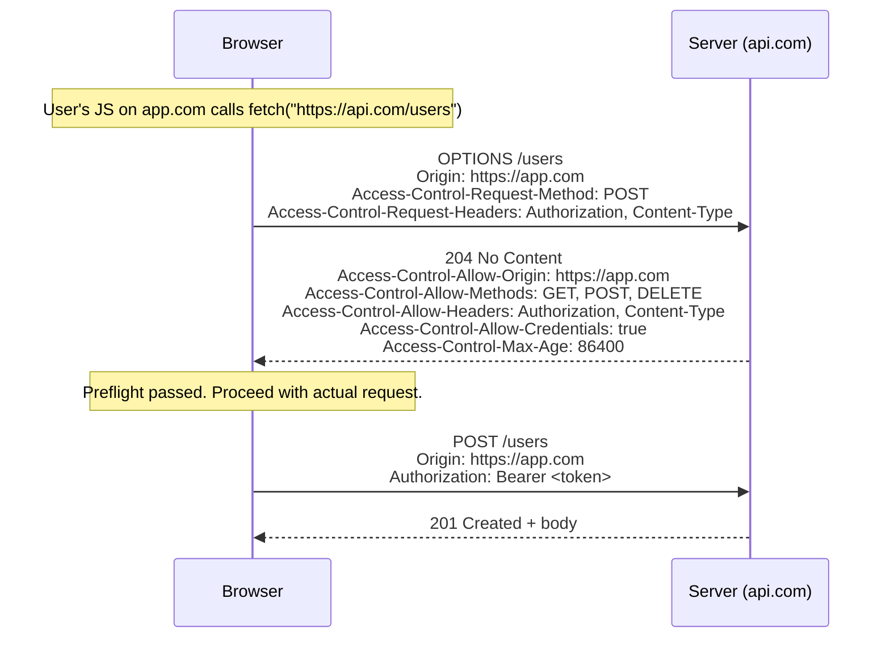

# 1. HTTP & Networking

### Why This Section Matters

Before you write a single line of backend code, your app is already making dozens of decisions about HTTP — which status code to return, whether to allow a cross-origin request, how headers control caching. Interviewers ask about HTTP not to quiz you on trivia, but to see if you understand *the contract* between client and server.

If you return `200` on a failed login instead of `401`, or forget to set `SameSite` on a cookie, your app is broken in ways that aren't caught by unit tests. HTTP knowledge is the difference between an engineer who knows their framework and one who understands what the framework is doing for them.

**What interviewers actually probe:**
- Do you know *why* 401 and 403 are different? (Not just what they mean — why both exist)
- Can you explain CORS from first principles, not just "add the header"?
- Do you understand caching enough to distinguish `no-cache` from `no-store`?
- Can you walk through "what happens when you type a URL" end to end?

---

## 1.1 HTTP Methods — Safe, Idempotent, Cacheable

These three properties are worth understanding from scratch, because they drive real design decisions.

**Safe** means the request doesn't change server state. A GET request for a user profile is safe — you can call it 1000 times and the data is the same.

**Idempotent** means calling it multiple times has the same *effect* as calling it once. DELETE is idempotent: deleting a resource that's already deleted gives you the same result (resource is gone). POST is not — hitting "submit order" 3 times creates 3 orders.

**Cacheable** means the response can be stored and reused. GET responses are cacheable by default; POST responses are not (because POST has side effects).

| Method  | Safe | Idempotent | Cacheable | Real use |
|---------|:----:|:----------:|:---------:|---------|
| GET     | ✅   | ✅         | ✅        | Read data |
| HEAD    | ✅   | ✅         | ✅        | Get headers only (check if resource exists without downloading body) |
| OPTIONS | ✅   | ✅         | ❌        | CORS preflight — browser asks "what methods do you allow?" |
| POST    | ❌   | ❌         | Conditional | Create, trigger actions |
| PUT     | ❌   | ✅         | ❌        | Full replace ("here is the new state of this resource") |
| PATCH   | ❌   | ❌ (by convention) | ❌ | Partial update — but JSON Patch/Merge Patch can be idempotent |
| DELETE  | ❌   | ✅         | ❌        | Delete (calling it twice: same result — resource is gone) |

**Common confusion:** PATCH is listed as non-idempotent by convention, but it *can* be idempotent depending on implementation. If your PATCH says "set name to Alice" it's idempotent. If it says "increment count by 1" it's not. The method itself doesn't guarantee — your implementation does.

---

## 1.2 Status Codes — What They Actually Signal

Think of status codes as a shared language between server and client. The client doesn't read your response body to decide what happened — it reads the status code first. Returning `200` with `{"error": "not found"}` in the body breaks this contract. Monitoring tools, API gateways, and retry logic all key off the status code, not the body.

**The categories:**
- `2xx` — It worked
- `3xx` — Go somewhere else (redirect or use cache)
- `4xx` — You (the client) made a mistake
- `5xx` — I (the server) made a mistake

| Code | Name | When to use |
|------|------|-------------|
| 200 | OK | Success with a response body |
| 201 | Created | POST succeeded — include `Location: /resource/id` header pointing to the new resource |
| 202 | Accepted | "I received your request, but I'm processing it asynchronously" — return a polling URL |
| 204 | No Content | Success, but no body — common for DELETE, or PUT when you don't return the updated resource |
| 301 | Moved Permanently | Old URL is dead, use the new one forever (browsers and crawlers update their bookmarks) |
| 302 | Found (Temporary) | Redirect, but keep using the original URL next time |
| 304 | Not Modified | Client sent `If-None-Match` or `If-Modified-Since`; content hasn't changed — use your cache |
| 400 | Bad Request | Client sent malformed syntax (e.g. invalid JSON) |
| 401 | Unauthorized | Not authenticated — "Who are you? Show me credentials." (the name is misleading; it means *unauthenticated*) |
| 403 | Forbidden | Authenticated, but not allowed — "I know who you are, but you can't do this" |
| 404 | Not Found | Resource doesn't exist (or you're hiding it intentionally — see below) |
| 409 | Conflict | State conflict — duplicate entry, optimistic lock failure, deleting something still in use |
| 410 | Gone | Resource *existed* but was permanently deleted — unlike 404 which is ambiguous |
| 422 | Unprocessable Entity | Syntax is valid, but semantically wrong (e.g. `start_date > end_date`) — FastAPI's default for validation errors |
| 429 | Too Many Requests | Rate limit hit — always include `Retry-After` header so clients know when to try again |
| 500 | Internal Server Error | Something broke on the server — never leak stack traces here |
| 502 | Bad Gateway | Your server got a bad response from an upstream service (e.g. the DB server crashed) |
| 503 | Service Unavailable | Overloaded or in maintenance — include `Retry-After` |
| 504 | Gateway Timeout | Upstream service didn't respond in time |

**401 vs 403 — the key insight:**
Return `401` when the request has no credentials at all. Return `403` when it has credentials but they're not sufficient. A practical trick: sometimes you *want* to return `404` instead of `403` — `403` tells an attacker "this resource exists and you don't have access," which leaks information and enables IDOR enumeration. For sensitive resources (other users' files, admin data), `404` reveals nothing.

**Common mistake:** Returning `200` with an error object in the body. Many API clients and monitoring tools check only the status code to decide if a request succeeded. `200` with `{"error": "unauthorized"}` registers as a success in your error rate metrics.

---

## 1.3 Important HTTP Headers

Headers are how HTTP communicates *metadata* about the request or response — format, caching rules, security policy, and authentication.

| Header | What it does | Why it matters |
|--------|-------------|----------------|
| `Content-Type` | Describes the body format | Both sides need to agree — `application/json`, `multipart/form-data`, `text/event-stream` (SSE for LLM streaming) |
| `Accept` | Client says "I want this format" | Content negotiation — server picks the best match |
| `Authorization: Bearer <token>` | Carries the JWT or OAuth token | Standard way to authenticate API requests |
| `Cache-Control` | Controls caching behavior | See §1.4 for full breakdown |
| `ETag` / `If-None-Match` | Content fingerprint for conditional requests | Client sends back the ETag it has; if unchanged, server replies `304` — saves bandwidth |
| `Vary` | Tells caches which headers make a response unique | `Vary: Accept-Language` caches a separate version per language |
| `X-Forwarded-For` | Real client IP when behind a load balancer or proxy | Don't use `request.remote_addr` if you have a reverse proxy — it gives you the proxy's IP, not the user's |
| `X-Request-ID` | Unique ID for tracing a request through distributed systems | Log this ID everywhere; correlates logs across services |
| `Strict-Transport-Security` (HSTS) | Forces HTTPS | Browser won't make plain HTTP requests to this domain once it's seen this header |
| `Content-Security-Policy` | Restricts what resources the browser can load | Primary defense against XSS |
| `Retry-After` | Tells clients when to retry after `429` or `503` | Without this, clients may immediately retry and make an overload situation worse |

---

## 1.4 HTTP Caching — `no-cache` vs `no-store` and the Full Model

Caching is one of the most misunderstood areas of HTTP. The names of the directives are counterintuitive, and the difference between browser cache, CDN cache, and proxy cache adds confusion. Let's break it down.

**The two players in caching:**
- **Private cache:** The browser. Only stores responses for one user.
- **Shared cache:** A CDN or reverse proxy (Cloudflare, nginx). Stores responses for all users.

**`Cache-Control` directives — what they actually mean:**

| Directive | Meaning | Common use |
|-----------|---------|-----------|
| `no-store` | **Never store this response anywhere.** Not in browser, not in CDN. | Sensitive data: financial records, personal health info |
| `no-cache` | **Store it, but always revalidate before using it.** The cache exists, but must check with the server first. | Data that changes frequently but you still want CDN-level storage |
| `max-age=N` | Cache is fresh for N seconds. No revalidation needed within that window. | Static assets, public API responses |
| `s-maxage=N` | Like `max-age` but only for shared caches (CDN). Browser ignores it. | Different TTL for CDN vs browser |
| `public` | Any cache (including CDNs) may store this. | Public content, no auth required |
| `private` | Only the browser may cache this. CDN must not store it. | User-specific responses (profile data, dashboards) |
| `must-revalidate` | Once stale, don't serve it — go to the server. No serving stale under any circumstances. | Prevents stale data from being served even under network errors |
| `stale-while-revalidate=N` | Serve the stale cache immediately, then refresh in the background. | Great for UX — user gets an instant response while fresh data loads |
| `immutable` | The content at this URL will never change. Skip revalidation entirely. | Versioned static assets (`app.abc123.js`) |

**The `no-cache` vs `no-store` trap:**

Most developers assume `no-cache` means "don't cache this." It doesn't. It means "cache it, but check with the server before every use." The response is stored; it's just always considered stale.

`no-store` is the one that truly prevents caching. Use it for anything that must not persist (auth tokens in responses, medical records, payment details).

```
Cache-Control: no-store              → never stored anywhere
Cache-Control: no-cache              → stored, but revalidated on every request
Cache-Control: max-age=3600          → fresh for 1 hour, no revalidation
Cache-Control: max-age=0, must-revalidate  → immediately stale, must revalidate
Cache-Control: private, max-age=300  → browser can cache for 5min, CDN cannot
Cache-Control: public, s-maxage=86400, stale-while-revalidate=3600
    → CDN caches for 24h; browser gets stale data but CDN refreshes in background
```

**Conditional requests — how `ETag` saves bandwidth:**

The browser stores a response along with its `ETag` (a hash of the content). On the next request, it sends `If-None-Match: "abc123"`. If the content hasn't changed, the server responds with `304 Not Modified` and an empty body — saving the full payload transfer.

```
Request:   GET /api/vocab-list
           If-None-Match: "etag-v42"

Response (unchanged):  304 Not Modified    ← no body, saves bandwidth
Response (changed):    200 OK + new body + ETag: "etag-v43"
```

**Nativ connection:** Nativ's vocabulary lists are user-specific, so `Cache-Control: private, max-age=60` makes sense. The system prompt for the RAG tutor is static per user — it's a candidate for `stale-while-revalidate` to serve fast while refreshing in the background after a vocabulary update.

---

## 1.5 CORS — Why It Exists and How It Works

**Why CORS exists:**

Browsers enforce the Same-Origin Policy: JavaScript on `https://app.com` cannot read responses from `https://api.com` by default. This prevents malicious sites from using your logged-in session to silently make requests to your bank.

CORS (Cross-Origin Resource Sharing) is the mechanism that lets servers *opt in* to allowing specific cross-origin requests. It's purely a browser enforcement — curl and server-to-server calls ignore it entirely.

**Two types of requests:**

**Simple request** (no preflight needed) — all three conditions must be met:
1. Method is GET, HEAD, or POST
2. No custom headers (only browser-set standard headers)
3. `Content-Type` is `application/x-www-form-urlencoded`, `multipart/form-data`, or `text/plain`

Sending JSON (`Content-Type: application/json`) or adding `Authorization` violates condition 2 or 3. This triggers a preflight.

**Preflight flow:**



If the server doesn't respond with the right `Access-Control-*` headers, the browser blocks the response from JavaScript — but the server still processed the request. The CORS block happens client-side.

**Critical rule — wildcard + credentials don't mix:**

`Access-Control-Allow-Origin: *` and `Access-Control-Allow-Credentials: true` cannot be set together. Browsers reject this combination. If you need to send cookies or `Authorization` headers on cross-origin requests, you must specify the exact origin.

```python
from fastapi.middleware.cors import CORSMiddleware

app.add_middleware(
    CORSMiddleware,
    allow_origins=["https://app.com"],  # exact origin — never "*" with credentials
    allow_credentials=True,
    allow_methods=["*"],
    allow_headers=["*"],
    max_age=86400,                      # cache preflight for 24h
)
```

**Common confusion:** Developers often think CORS is a server-side security measure. It's not — it's a browser-side restriction. A malicious server can ignore CORS entirely. CORS protects your *users* from malicious websites, not your server from malicious clients.

---

## 1.6 Cookie Flags — Security Defaults

Cookies carry session tokens and auth state. The flags control who can read them and when they're sent.

| Flag | What it does | Why you want it |
|------|-------------|-----------------|
| `HttpOnly` | JavaScript cannot read this cookie | Prevents XSS from stealing session tokens — `document.cookie` won't include it |
| `Secure` | Only sent over HTTPS | Prevents tokens from leaking over plain HTTP connections |
| `SameSite=Strict` | Cookie only sent on same-site requests | Strongest CSRF protection; but breaks OAuth redirects and email links |
| `SameSite=Lax` *(browser default)* | Sent for top-level navigation (clicking a link); blocked for cross-site sub-requests | Good balance — email links work, but CSRF from embedded iframes/forms doesn't |
| `SameSite=None` | Sent in all cross-site contexts | Required for embedded widgets, third-party auth — must pair with `Secure` |
| `Domain` | Which (sub)domains receive the cookie | `.example.com` shares the cookie across all subdomains |
| `Max-Age` / `Expires` | Cookie lifetime | No expiry = session cookie (deleted when browser closes); with expiry = persistent |

**Practical default for auth cookies:** `HttpOnly; Secure; SameSite=Lax`

This configuration:
- Blocks XSS from reading the token (`HttpOnly`)
- Blocks network sniffing (`Secure`)
- Blocks CSRF from embedded forms while keeping normal navigation flows working (`Lax`)

---

## 1.7 HTTP/1.1 vs HTTP/2 vs HTTP/3

**The problem each version solved:**

HTTP/1.1 kept connections alive (keep-alive) but processed requests sequentially on each connection. To load 30 assets in parallel, browsers opened 6 TCP connections per domain — wasteful and limited.

HTTP/2 solved this with **multiplexing**: multiple requests and responses flow over a single TCP connection simultaneously, interleaved as frames. One connection replaces 6. But TCP still causes problems: if one packet is dropped, TCP stalls *all* streams on that connection while retransmitting — this is transport-level head-of-line blocking.

HTTP/3 replaces TCP with **QUIC** (built on UDP). Each stream is independent at the transport layer — a dropped packet only stalls that one stream. Faster handshakes and built-in TLS 1.3.

| | HTTP/1.1 | HTTP/2 | HTTP/3 |
|-|---------|--------|--------|
| Transport | TCP | TCP | QUIC (UDP) |
| Multiplexing | ❌ (sequential per connection) | ✅ (app-level) | ✅ (transport-level, no HOL) |
| Header compression | ❌ | HPACK | QPACK |
| 0-RTT reconnection | ❌ | ❌ | ✅ |
| TLS | Optional | Optional (required in practice) | Always |
| Where used today | Universal | Dominant for APIs | CDN edge, growing |

**When does this matter in practice?** HTTP/3 is most impactful for mobile users (high packet loss on cellular) and real-time streaming (LLM token streams, video). For internal service-to-service calls in a datacenter with sub-0.1% packet loss, HTTP/2 is already fine.

---

## 1.8 TLS — How HTTPS Works

HTTPS encrypts traffic using TLS. Three concepts matter for interviews:

**1. Handshake cost — 1 RTT in TLS 1.3**

Before any data flows, client and server exchange keys to derive a shared session key. TLS 1.3 does this in a single round trip (TLS 1.2 needed 2). This is why the first HTTPS request to a cold server costs one extra round trip compared to a subsequent request on the same connection.

**2. Forward secrecy**

Each TLS 1.3 session uses a fresh, throwaway keypair. If the server's long-term private key leaks years later, past recorded sessions can't be decrypted — the session keys no longer exist. This protects against "record now, decrypt later" attacks.

**3. 0-RTT resumption — faster but unsafe for writes**

On reconnection, the client can send data in the very first packet using a cached session key. The catch: that first-packet data can be replayed by an attacker. Never use 0-RTT paths for non-idempotent requests (POST, DELETE, any state-changing call).

---

## 1.9 TCP Basics

Understanding TCP matters when diagnosing connection timeouts, slow cold starts, or performance problems under load.

**3-way handshake (connection open):** `SYN → SYN-ACK → ACK`

Before any data flows, three packets are exchanged. This is why the first request to a cold server costs one extra round trip. Connection pools exist specifically to avoid this cost on every request.

**4-way handshake (connection close):** `FIN → ACK → FIN → ACK`

Each side closes independently. `TIME_WAIT` connections in `netstat` output are normal — not a leak.

**Keep-alive and connection pooling:**

HTTP keep-alive reuses a TCP connection across multiple requests. At scale, connection pools (SQLAlchemy's pool, httpx's connection pool) maintain a fixed set of open connections to backends, reusing them instead of opening a new one per request. Exhausting the pool is a common production bottleneck — every request starts queuing instead of executing.

**Nagle's algorithm:** Buffers small packets and waits for an ACK before sending more — reduces packet count but adds latency. Disable it (`TCP_NODELAY`) for real-time apps like LLM streaming.

---

## 1.10 DNS — What Happens When You Type a URL

This is one of the most common "walkthrough" questions in backend interviews. It tests whether you understand the full request lifecycle before HTTP even begins.

**Step by step: `https://nativ.to/vocab`**

```
1. Browser cache
   → Has nativ.to been resolved recently? If yes, use cached IP. Skip to step 6.

2. OS resolver / hosts file
   → Check /etc/hosts (or C:\Windows\System32\drivers\etc\hosts).
   → Check OS DNS cache (nscd, systemd-resolved).

3. Recursive DNS query
   → Ask the configured DNS resolver (usually your router or ISP, e.g. 8.8.8.8).
   → If resolver doesn't have it cached:
     a. Ask a Root nameserver → returns address of TLD nameserver for ".to"
     b. Ask the .to TLD nameserver → returns address of nativ.to's authoritative nameserver
     c. Ask nativ.to's authoritative nameserver → returns the A record (IP address)
   → Resolver caches the result for the record's TTL, returns it to the browser.

4. TCP + TLS
   → Browser opens TCP connection to the IP on port 443.
   → TLS 1.3 handshake (1 RTT).

5. HTTP request
   → GET /vocab HTTP/2
   → Host: nativ.to

6. Response
   → Server returns 200 + HTML (or 301 redirect, or API response).
```

**DNS TTL — the tradeoff:**

A low TTL (30-60s) means DNS changes propagate quickly — useful for incident response (point traffic to a new server fast). A high TTL (1 hour+) means fewer DNS queries and faster resolution from cache, but slower failover.

**DNS record types (the two you'll need in interviews):**

| Record | Purpose | Example |
|--------|---------|---------|
| A | Domain → IPv4 address | `nativ.to → 1.2.3.4` |
| CNAME | Domain → another domain (alias) | `www.nativ.to → nativ.to` |

---

## 1.11 Interview Answer Scripts

**Q: "What's the difference between 401 and 403?"**

> "401 means unauthenticated — the server doesn't know who you are. No token, expired token, or invalid token. 403 means authenticated but not authorized — the server knows exactly who you are, but you don't have permission for this action. Practical example: calling an API with no `Authorization` header gets you 401; using a valid regular-user token on an admin-only endpoint gets you 403. There's also a deliberate pattern of returning 404 instead of 403 — called IDOR prevention. If I return 403, I'm telling an attacker 'this resource exists and you can't access it,' which is information they can use to enumerate IDs. Returning 404 gives away nothing."

**Q: "When does a CORS preflight happen, and why does `Access-Control-Allow-Origin: *` break with credentials?"**

> "A preflight OPTIONS request fires when the request doesn't meet the 'simple request' criteria — basically, whenever you use JSON (`Content-Type: application/json`) or any custom header like `Authorization`. The browser sends OPTIONS first, the server declares what it allows, and then the actual request proceeds. The wildcard-plus-credentials problem comes from the browser's security model: if the server allows cookies or auth headers from *any* origin, a malicious site could use your logged-in session to make requests on your behalf to any API — that's CSRF at scale. So browsers flat-out reject the combination of `Allow-Origin: *` and `Allow-Credentials: true`. Once you need credentials, you have to name the exact origin."

**Q: "What's the difference between HTTP/2 and HTTP/3?"**

> "HTTP/2 solved application-level head-of-line blocking from HTTP/1.1 with multiplexing — multiple streams over one TCP connection. But TCP itself is still the bottleneck: one lost packet stalls all streams on that connection while TCP retransmits. HTTP/3 addresses this by running over QUIC, which is built on UDP. Each stream is fully independent at the transport layer, so a lost packet only affects that one stream. HTTP/3 also collapses the TLS handshake into the QUIC handshake, enabling 0-RTT reconnection. In practice, HTTP/2 dominates internal services today, and HTTP/3 is rolling out at the CDN edge."

**Q: "Walk me through what happens between the user pressing Enter and your API returning a response."**

> "Starting from the URL: first, DNS resolution. The browser checks its cache, then the OS cache, then queries a recursive DNS resolver which works through root → TLD → authoritative nameservers to get the IP. The result is cached for the record's TTL. Then a TCP connection to port 443, followed by a TLS 1.3 handshake — that's 1 round trip for key exchange and certificate verification. Once encrypted, the browser sends an HTTP/2 GET. On the server side: the request hits a load balancer, routes to an application server, goes through middleware (auth, logging), hits the route handler, queries the database, and returns a response. The response comes back through TLS, TCP, and the browser renders it. The interesting failure modes are at each boundary: DNS failure, TCP timeout, TLS cert mismatch, load balancer dropping the connection, app throwing a 500."

**Q: "When should you use `no-store` vs `no-cache`?"**

> "`no-store` means never persist this response anywhere — not in the browser, not in a CDN. Use it for genuinely sensitive data: auth tokens in response bodies, personal health records, payment confirmations. `no-cache` is often misunderstood — it doesn't prevent caching, it just marks the cached copy as always needing revalidation before use. The cache exists; it's just always stale. `no-cache` is useful when you want a CDN to store the response for de-duplication (many users hitting simultaneously) but you don't want stale data served. I'd use it for an API endpoint that queries a frequently-updating database."

---

## 1.12 Self-Tests

Try answering these out loud before looking at the answers.

1. Your colleague set `Cache-Control: no-cache, no-store` on a public API endpoint that returns a list of product categories — data that changes once a week. What's the problem and what would you set instead?
2. A user reports they're being logged out whenever they click a link from your marketing email. Your auth uses cookie-based sessions. What's the likely cause and fix?
3. You deploy a change to `nativ.to`'s server IP, but 30 minutes later, some users are still hitting the old server. Name two distinct reasons this could happen and how you'd diagnose each.
4. Your frontend at `https://app.nativ.to` fetches from `https://api.nativ.to`. CORS errors are appearing in production but not locally. What's the most likely difference and how do you fix it?
5. A client calls your API and gets a `502 Bad Gateway`. Walk through the three most likely root causes and how you'd investigate each.

<details>
<summary>Answers</summary>

1. `no-store` prevents caching entirely — every request hits your origin server. For public data that changes once a week, this is unnecessary load. Better: `Cache-Control: public, max-age=3600, stale-while-revalidate=86400`. This lets CDNs cache it for 1 hour, then serve stale while refreshing in the background. `no-cache` would also be an improvement over `no-store` — at least the CDN de-duplicates requests. Only use `no-store` for content that must never persist (tokens, PII).

2. The cookie is likely set with `SameSite=Strict`. Clicking a link in email is a cross-site navigation (from the email client's origin to your app), and `Strict` blocks the cookie from being sent on any cross-site request — including top-level navigation from external origins. Fix: change to `SameSite=Lax`, which allows cookies on top-level navigations (link clicks) but still blocks CSRF from embedded forms and iframes.

3. Two causes: (a) **DNS TTL**: if the old DNS record had a long TTL (e.g. 1 hour), resolvers and browsers cached the old IP for that duration. Diagnose with `dig nativ.to +short` from different locations (or use dnschecker.org). Fix: lower TTL before migrations, or wait for TTL to expire. (b) **Browser/OS DNS cache**: even after the resolver updates, the user's local machine may have the old IP cached. Diagnose by asking the user to flush their DNS cache (`ipconfig /flushdns` on Windows, `sudo dscacheutil -flushcache` on Mac). Fix: advise them to flush, or lower OS-level TTLs.

4. Locally, you're probably running both frontend and backend on `localhost` — same origin, so CORS doesn't apply. In production, they're on different subdomains (`app.nativ.to` vs `api.nativ.to`), which are different origins. The fix: add `app.nativ.to` to the server's `allow_origins` list. If you used `allow_origins=["http://localhost:3000"]` during development and forgot to add the production origin, that's the exact bug. Also check that `allow_credentials=True` is only set when you actually need it — if you're using Authorization headers instead of cookies, you may not need it.

5. Three likely causes: (a) **Upstream service (DB, Redis, another API) is down** — the gateway/load balancer got a connection refused or error from the backend. Check application logs and the health of downstream services. (b) **Application server crashed or is out of workers** — the LB has no healthy instances to route to. Check container/process status, restart logs, memory/OOM killer events. (c) **Timeout** — the upstream responded too slowly and the gateway gave up. Look for corresponding `504 Gateway Timeout` patterns; check DB query times, external API latency. Investigate by checking: load balancer logs (which backend it tried), application logs on that instance, and infrastructure metrics (CPU, memory, DB connections).

</details>

---

← Back to [Index](../README.md) | Next → [2. REST API Design](2-rest-api-design.md)
