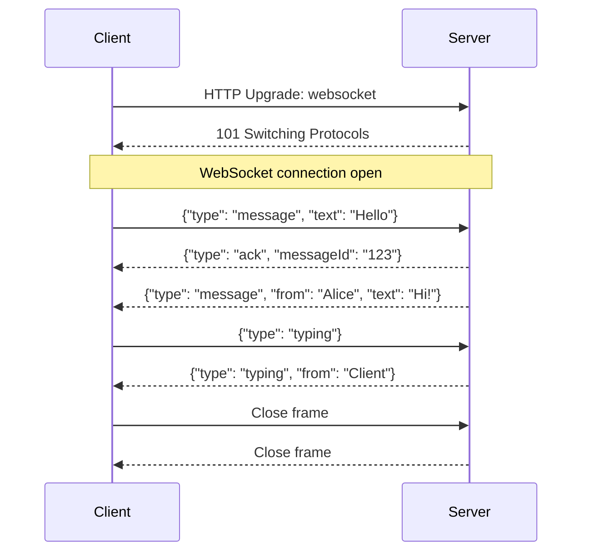

# 17. Streaming (SSE / WebSocket)

### Why This Section Matters

Streaming is the core UX pattern of modern AI apps — LLM responses stream token by token instead of arriving all at once. Understanding how Server-Sent Events (SSE) and WebSockets work, when to choose each, and how to implement them correctly is a direct requirement for AI product roles.

Interviewers will ask both the theory (protocol differences, connection lifecycle) and the implementation (how to stream from an LLM API, how to handle reconnection, what happens when the connection drops).

**What interviewers actually probe:**
- What's the difference between SSE and WebSockets?
- How do you implement SSE in FastAPI and Next.js?
- How does LLM streaming work under the hood?
- What happens when an SSE connection drops?

---

## 17.1 SSE vs WebSocket — The Core Tradeoff

Both keep a persistent connection open between client and server. The fundamental difference is directionality.

**Server-Sent Events (SSE):**
- One-way: server → client only
- Built on HTTP — standard HTTP/1.1 or HTTP/2 connection
- Auto-reconnect built into the browser EventSource API
- Text-based (UTF-8 only)
- Best for: streaming text responses, notifications, live feed updates

**WebSocket:**
- Bidirectional: client ↔ server simultaneously
- Upgrades from HTTP to its own protocol (ws:// or wss://)
- No built-in reconnection — must implement manually
- Binary or text
- Best for: chat, real-time games, collaborative editing, bidirectional signaling

```
SSE:  Client ←←←←←←←←←←←←←← Server   (one direction, HTTP-based)
WS:   Client ↔↔↔↔↔↔↔↔↔↔↔↔↔↔↔ Server   (bidirectional, separate protocol)
```

**Why AI apps use SSE, not WebSocket:**
LLM streaming is one-directional — the user submits a prompt, the server streams back tokens. SSE is simpler: no protocol upgrade, no reconnection logic to write, works with standard HTTP infrastructure (load balancers, proxies, CDNs) without special configuration. WebSockets need sticky sessions or a pub/sub layer to work behind multiple server instances.

> **Nativ connection:** Nativ uses SSE for streaming AI-generated vocabulary explanations. The client sends a regular POST request to initiate generation, and the server streams the response as SSE events. This pattern works because the communication is one-directional after the initial request.

---

## 17.2 SSE Protocol — How It Works

SSE is a standard HTTP response with `Content-Type: text/event-stream`. The connection stays open, and the server sends newline-delimited event data.

```
HTTP/1.1 200 OK
Content-Type: text/event-stream
Cache-Control: no-cache
Connection: keep-alive

data: {"token": "Hello"}

data: {"token": " World"}

data: [DONE]
```

**Event format:**
- `data:` — the payload (can be JSON, text, or any string)
- `event:` — optional event name (client subscribes to specific events)
- `id:` — optional event ID (for reconnection — browser sends `Last-Event-ID` header)
- `retry:` — optional reconnection delay in ms

The client-side browser API:

```javascript
const eventSource = new EventSource("/api/stream");

eventSource.onmessage = (event) => {
    const data = JSON.parse(event.data);
    if (data === "[DONE]") {
        eventSource.close();
        return;
    }
    appendToken(data.token);
};

eventSource.onerror = () => {
    // Browser automatically reconnects — onerror fires on disconnect
    console.log("Reconnecting...");
};
```

**Auto-reconnection:** The browser's `EventSource` automatically reconnects after a dropped connection (default 3 seconds). It sends the `Last-Event-ID` header with the last received event ID, letting the server replay missed events.

---

## 17.3 Implementing SSE in FastAPI

FastAPI uses `StreamingResponse` with a generator to implement SSE.

```python
from fastapi import FastAPI
from fastapi.responses import StreamingResponse
import asyncio
import json

app = FastAPI()

async def llm_stream_generator(prompt: str):
    """Yields SSE-formatted chunks from OpenAI streaming API."""
    from openai import AsyncOpenAI

    client = AsyncOpenAI()
    stream = await client.chat.completions.create(
        model="gpt-4o",
        messages=[{"role": "user", "content": prompt}],
        stream=True,
    )

    async for chunk in stream:
        delta = chunk.choices[0].delta
        if delta.content:
            # SSE format: "data: {json}\n\n"
            data = json.dumps({"token": delta.content})
            yield f"data: {data}\n\n"

    yield "data: [DONE]\n\n"   # signal completion

@app.post("/stream")
async def stream_response(request: StreamRequest):
    return StreamingResponse(
        llm_stream_generator(request.prompt),
        media_type="text/event-stream",
        headers={
            "Cache-Control": "no-cache",
            "X-Accel-Buffering": "no",   # disable nginx buffering
        },
    )
```

**Critical header: `X-Accel-Buffering: no`** — tells nginx (and other reverse proxies) not to buffer the response. Without this, the proxy accumulates the entire response before forwarding it, defeating the purpose of streaming.

---

## 17.4 Implementing SSE in Next.js App Router

In the App Router, streaming responses use the `ReadableStream` Web API.

```typescript
// app/api/stream/route.ts
import OpenAI from "openai";

const openai = new OpenAI();

export async function POST(req: Request) {
    const { prompt } = await req.json();

    const stream = await openai.chat.completions.create({
        model: "gpt-4o",
        messages: [{ role: "user", content: prompt }],
        stream: true,
    });

    const encoder = new TextEncoder();

    const readableStream = new ReadableStream({
        async start(controller) {
            for await (const chunk of stream) {
                const content = chunk.choices[0]?.delta?.content;
                if (content) {
                    controller.enqueue(
                        encoder.encode(`data: ${JSON.stringify({ token: content })}\n\n`)
                    );
                }
            }
            controller.enqueue(encoder.encode("data: [DONE]\n\n"));
            controller.close();
        },
    });

    return new Response(readableStream, {
        headers: {
            "Content-Type": "text/event-stream",
            "Cache-Control": "no-cache",
            "Connection": "keep-alive",
        },
    });
}
```

**Vercel AI SDK shortcut** — wraps all of this:

```typescript
import { streamText } from "ai";
import { openai } from "@ai-sdk/openai";

export async function POST(req: Request) {
    const { messages } = await req.json();
    const result = streamText({ model: openai("gpt-4o"), messages });
    return result.toDataStreamResponse();
}
```

---

## 17.5 WebSocket — When You Actually Need It

WebSockets are necessary when the client needs to send messages *after* the connection is established — not just receive them.

**Sequence diagram for a WebSocket chat:**



**FastAPI WebSocket implementation:**

```python
from fastapi import WebSocket, WebSocketDisconnect
from typing import Dict

class ConnectionManager:
    def __init__(self):
        self.active_connections: Dict[str, WebSocket] = {}

    async def connect(self, user_id: str, ws: WebSocket):
        await ws.accept()
        self.active_connections[user_id] = ws

    def disconnect(self, user_id: str):
        self.active_connections.pop(user_id, None)

    async def broadcast(self, message: dict, exclude: str = None):
        for uid, ws in self.active_connections.items():
            if uid != exclude:
                await ws.send_json(message)

manager = ConnectionManager()

@app.websocket("/ws/{user_id}")
async def websocket_endpoint(websocket: WebSocket, user_id: str):
    await manager.connect(user_id, websocket)
    try:
        while True:
            data = await websocket.receive_json()
            await manager.broadcast({"from": user_id, **data}, exclude=user_id)
    except WebSocketDisconnect:
        manager.disconnect(user_id)
        await manager.broadcast({"type": "user_left", "user_id": user_id})
```

**Scaling WebSockets across multiple server instances:** WebSockets are stateful — a connection is bound to a specific server process. If you have 3 server instances and user A connects to instance 1, a message sent to user B (connected to instance 2) can't reach user A through the same server. Fix: use a pub/sub layer (Redis pub/sub) — every instance subscribes to a shared channel and broadcasts locally to its connected clients.

---

## 17.6 Interview Answer Scripts

**Q: "What's the difference between SSE and WebSockets, and when would you choose each?"**

> "Both keep a persistent connection open, but they differ in directionality and protocol. SSE is one-way — server to client only — and runs over standard HTTP. WebSockets are bidirectional and use a separate protocol after an HTTP upgrade handshake. For AI applications, SSE is almost always the right choice for streaming model output: the user sends a prompt (regular HTTP request), the server streams tokens back (SSE). SSE works with standard HTTP infrastructure — no special proxy configuration, load balancers handle it normally, and the browser's EventSource API has built-in reconnection. WebSockets are necessary when the client needs to send multiple messages over the same connection after it's established — real-time chat, collaborative editing, gaming. If you're building a chat interface for an LLM where users can interrupt or send follow-ups mid-stream, WebSockets make sense. For simple prompt-and-stream, SSE is simpler and more reliable."

**Q: "How do you implement LLM streaming in FastAPI?"**

> "You use `StreamingResponse` with an async generator. The generator connects to the OpenAI streaming API, iterates over chunks, and yields each chunk formatted as SSE: `data: {json}\n\n`. FastAPI wraps the generator in a streaming HTTP response with `Content-Type: text/event-stream`. Two critical things: first, set `Cache-Control: no-cache` or proxies will buffer the response. Second, if you're behind nginx, add `X-Accel-Buffering: no` — otherwise nginx buffers the entire response before forwarding and you lose streaming. On the client, `EventSource` handles reconnection automatically. If you need POST semantics (for the initial prompt), you can use `fetch` with `ReadableStream` on the client instead of `EventSource`, which is what the Vercel AI SDK does."

**Q: "What happens when an SSE connection drops?"**

> "The browser's `EventSource` API has built-in reconnection — after a disconnect (network interruption, server restart), it waits a few seconds (configurable via the `retry:` field in the event stream) and reconnects automatically. When it reconnects, it sends the `Last-Event-ID` header containing the ID of the last event it received. The server can use this to replay missed events. For LLM streaming, most implementations don't replay on reconnect — instead, they restart the generation from scratch or show an error. If you need resumable streaming (long generation that must complete), you'd store the generated tokens server-side with an ID, and on reconnect resume from where the client left off. That's more complex but necessary for high-reliability use cases."

**Q: "How do you handle backpressure in a streaming LLM response when the client is slower than the server?"**

> "Backpressure is the problem of a fast producer overwhelming a slow consumer. In LLM streaming, the model generates tokens faster than a slow network or slow client can consume them. The HTTP layer handles this automatically — TCP flow control pauses the server-side writes when the client's receive buffer is full. In Python's async context, `await websocket.send_text(chunk)` or yielding from a `StreamingResponse` generator will pause when the socket buffer is full, backpressuring the generator. The issue: while the server-side generator is paused, the upstream LLM API call is still running and accumulating tokens in the API response buffer. Most LLM client libraries (OpenAI, Anthropic) handle this — their async iterators pause when you stop consuming them. The practical concern is server memory: if thousands of users have slow connections with large LLM responses buffered mid-stream, memory usage can spike. The fix: set aggressive timeouts on slow clients and impose a maximum response size with `max_tokens`."

> **Nativ connection:** Nativ uses SSE for streaming vocabulary explanations from Claude — the generator yields chunks from the Anthropic streaming API, and FastAPI's `StreamingResponse` handles backpressure transparently. The `X-Accel-Buffering: no` header is set on the response to disable nginx proxy buffering.

---

## 17.7 Self-Tests

Try answering these before looking at the answers.

1. You implement SSE behind an AWS Application Load Balancer. Users report that the stream "arrives all at once" instead of token by token. What's the cause?
2. Your WebSocket server has 3 instances behind a load balancer. User A is on instance 1, user B is on instance 2. User A sends a message to user B. What happens and how do you fix it?
3. A user navigates away from the AI response page mid-stream. The SSE connection closes. What happens to the ongoing OpenAI API call server-side?
4. You want to stream a 10MB CSV file download from a FastAPI endpoint. Would you use SSE or a streaming HTTP response? What's the difference?
5. The browser `EventSource` only supports GET requests, but your LLM endpoint needs to receive a prompt via POST. How do you handle this?

<details>
<summary>Answers</summary>

1. The Application Load Balancer (ALB) is buffering the response. ALBs have response buffering enabled by default — they wait until the response is complete before forwarding. For SSE to work properly, you need to disable response buffering on the ALB. In AWS, this is done by setting the `stickiness` target group attribute or by using the `X-Accel-Buffering: no` header (for ALBs with proxy_buffering behavior). Alternatively, if running behind nginx as a reverse proxy, `proxy_buffering off;` or the `X-Accel-Buffering: no` response header disables buffering. CloudFront has the same issue — it must be configured with no caching and `Cache-Control: no-cache` on the response.

2. The message can't be delivered — the in-memory `ConnectionManager` on instance 1 has no reference to user B's WebSocket on instance 2. The broadcast to `self.active_connections` only finds locally connected clients. Fix: use Redis pub/sub as a message bus. When user A sends a message, instance 1 publishes to a Redis channel (`chat:global` or `chat:room:{room_id}`). All three instances subscribe to that channel. Each instance receives the message from Redis and broadcasts it to their locally connected clients. This requires a long-running Redis subscription per server instance, which runs in a background task or thread.

3. By default, nothing stops the OpenAI API call. The server-side generator is still running, still receiving tokens from OpenAI, and trying to write to a closed connection (which raises an exception). In FastAPI, when the client disconnects and the generator tries to `yield` to the closed response, it raises a `GeneratorExit` or `CancelledError`. You should handle this explicitly: catch `asyncio.CancelledError` in the generator, close the OpenAI stream, and exit cleanly. Additionally, you're paying for tokens generated after the user left. For cost efficiency, check `request.is_disconnected()` in the generator loop and break early if the client is gone.

4. Use a regular streaming HTTP response, not SSE. SSE is specifically for the event stream protocol — it's text-based, has a specific `data:` format, and is designed for discrete events. For a file download, you want `Content-Type: application/octet-stream` (or `text/csv`) and a streaming binary response. In FastAPI: `StreamingResponse(iter_csv_chunks(), media_type="text/csv", headers={"Content-Disposition": "attachment; filename=data.csv"})`. SSE would work technically but is semantically wrong — parsers would strip the `data:` prefixes, you'd add unnecessary overhead, and binary data would need base64 encoding.

5. Use `fetch` with a `ReadableStream` instead of `EventSource`. `EventSource` only supports GET and doesn't allow custom headers or request bodies. The pattern: `const response = await fetch('/api/stream', { method: 'POST', body: JSON.stringify({ prompt }) })`, then read `response.body` as a `ReadableStream`: `const reader = response.body.getReader()`. Read chunks in a loop: `while (true) { const { done, value } = await reader.read(); if (done) break; processChunk(value); }`. This is exactly how the Vercel AI SDK's `useChat` hook works — it uses fetch with POST, not EventSource. You lose the auto-reconnect feature of EventSource, so you need to implement reconnection logic manually if needed.

</details>

---

← Back to [16. Next.js App Router](16-nextjs.md) | Next → [18. Concurrency & Race Conditions](18-concurrency.md)
