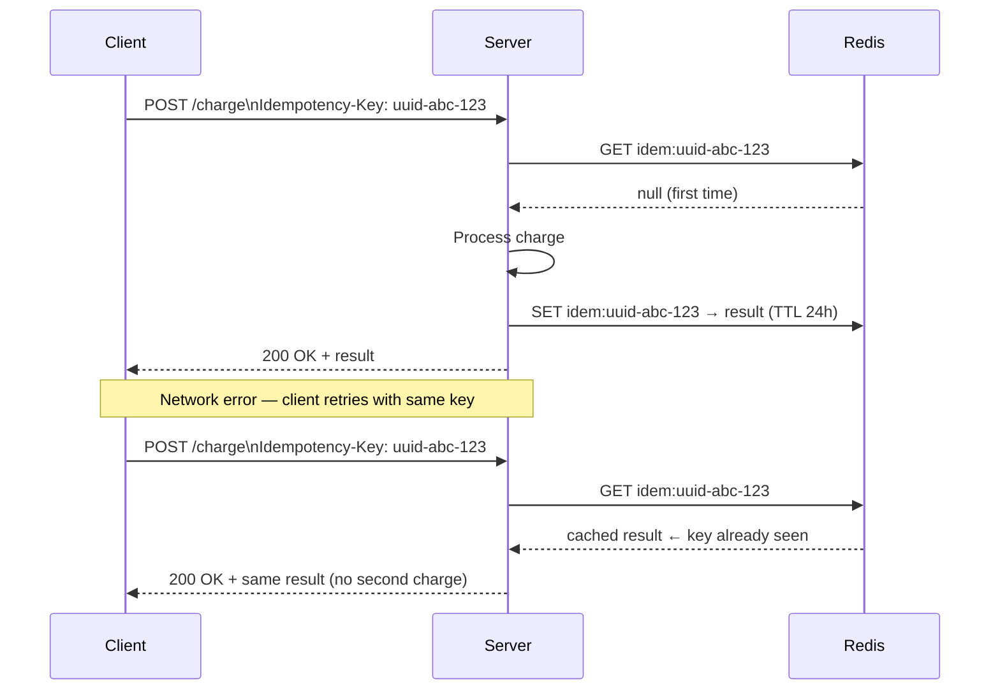

# 2. REST API Design

### Why This Section Matters

API design is one of the clearest signals of engineering maturity. A junior engineer makes things work. A senior engineer designs an interface that other engineers — and future code — can rely on without surprises.

In interviews, REST API questions show up in two forms: direct ("explain REST constraints") and embedded ("design an API for X"). The embedded form is more common and harder — it assumes you can translate principles into concrete decisions under time pressure.

Bad API design has real costs: once clients adopt an endpoint, changing its shape means a migration. The decisions you make at design time — resource names, status codes, pagination strategy, idempotency guarantees — become load-bearing walls.

**What interviewers actually probe:**
- Can you explain *why* an endpoint is designed a specific way, not just what it returns?
- Do you know when to use `PUT` vs `PATCH`, and why it matters beyond convention?
- How do you handle pagination at scale — and do you know why `OFFSET` breaks down?
- If a client retries a payment request due to a timeout, how do you prevent a double charge?

---

## 2.1 REST Constraints — The Two That Actually Matter

REST has six formal constraints (Client-Server, Stateless, Cacheable, Uniform Interface, Layered System, Code on Demand). In practice, two drive most design decisions:

**Stateless:** Every request must contain all information the server needs to process it. The server stores no session state between requests. This is why JWTs are sent on every request rather than stored server-side — and why scaling is straightforward (any instance handles any request).

The consequence: if you need to keep state (shopping cart, pagination cursor), the client holds it or it goes to a shared store like Redis — not in-memory on the app server.

**Uniform Interface:** Resources are identified by URLs. Representations (JSON, XML) are separate from the resource itself. Clients interact through standard HTTP methods, not custom verbs.

The consequence: `POST /send-email` is not REST. `POST /emails` is. The verb is already in the HTTP method; the URL names the resource.

The other four constraints (caching, layering, etc.) are good practice but rarely the focus of an interview question at the product-engineer level.

---

## 2.2 Resource Naming — Nouns, Not Verbs

The most common mistake in API design is leaking implementation or operations into URLs.

```
# Bad — verbs in URL, implementation leaking
GET  /getUser?id=123
POST /createUser
POST /deleteUser?id=123
GET  /fetchUserOrders?userId=123

# Good — resources are nouns, actions come from HTTP methods
GET    /users/123
POST   /users
DELETE /users/123
GET    /users/123/orders
```

**Hierarchy only when it makes sense:** Nest resources when the child genuinely belongs to the parent and you'd never access it independently.

```
GET /users/123/orders          ← orders belong to a user — nesting makes sense
GET /orders/456/items          ← items belong to an order — fine

GET /users/123/products        ← products exist independently — don't nest
GET /products?created_by=123   ← filter instead
```

**Actions that don't map cleanly to CRUD:** Use sub-resources for operations.

```
POST /orders/456/cancel        ← "cancel" is an action on an order
POST /users/123/verify-email   ← triggers an email send
POST /payments/789/refund      ← refund is a new event on a payment
```

These are still nouns under the hood (a "cancellation", an "email verification"), they just read naturally as actions.

---

## 2.3 Idempotency — Preventing Double Actions

**Why this matters more than you'd think:**

Networks fail. Clients retry. A payment button is clicked twice. If your `POST /charge` is not idempotent, the user gets charged twice. This is a real production bug pattern.

Idempotency in POST requests is solved with an **Idempotency Key** — a client-generated UUID that the server uses to deduplicate requests.



```python
from fastapi import Header, HTTPException
import redis.asyncio as redis
import json

r = redis.Redis()

@app.post("/charge")
async def charge(
    req: ChargeRequest,
    idempotency_key: str = Header(alias="Idempotency-Key"),
):
    cache_key = f"idem:{idempotency_key}"
    cached = await r.get(cache_key)
    if cached:
        return json.loads(cached)           # return same result, no side effect

    result = await process_charge(req)      # actual work
    await r.setex(cache_key, 86400, json.dumps(result))  # store for 24h
    return result
```

**Key design decisions:**
- The client generates the key (UUID), not the server — so the client controls retry identity
- TTL of 24 hours is common (Stripe uses this)
- Concurrent requests with the same key need locking to prevent race conditions — use `SET NX` or a DB unique constraint

**Common confusion:** Idempotency and safety are different. A safe operation (GET) doesn't change state. An idempotent operation (DELETE, PUT, and POST-with-key) can change state, but calling it multiple times has the same effect as calling it once.

---

## 2.4 Pagination — Why `OFFSET` Breaks at Scale

Three strategies exist. Knowing their tradeoffs is what separates a thoughtful answer from a lookup answer.

**Offset pagination** (`?page=5&limit=20` or `?offset=100&limit=20`):

The database executes `SELECT ... LIMIT 20 OFFSET 100` — which means the DB reads and discards 100 rows before returning 20. At offset=100,000, it reads 100,020 rows to return 20. Gets slower as you page deeper.

Worse: if a row is inserted or deleted between page requests, rows shift — a user sees duplicates or skips an item entirely.

Use it when: the dataset is small, users genuinely need to jump to arbitrary pages (admin tables, search results).

**Cursor pagination** (`?cursor=eyJpZCI6MTAwfQ&limit=20`):

The cursor encodes the position of the last seen item (usually a base64-encoded `{id: 100}`). The query becomes `WHERE id > 100 LIMIT 20` — which uses an index and is O(1) regardless of how deep you are.

No duplicates or skips because the cursor points to a stable position in the data.

Use it when: infinite scroll feeds, chat history, any high-volume stream.

**Keyset / Seek** (`?after_id=100&limit=20`):

Similar to cursor but the position is explicit in the query parameter, not encoded. Less opaque, same performance benefits.

Use it when: the sort key is a stable unique column (ID, timestamp), and you don't need to jump to arbitrary positions.

| | Offset | Cursor | Keyset |
|-|--------|--------|--------|
| Arbitrary page jump | ✅ | ❌ | ❌ |
| Performance at depth | ❌ degrades | ✅ constant | ✅ constant |
| Stable under inserts | ❌ | ✅ | ✅ |
| Implementation complexity | Low | Medium | Low–Medium |
| Best for | Admin panels | Feeds, chat | Logs, time-series |

**Nativ connection:** Nativ's vocabulary session history uses cursor pagination — the user's word history can be long, and we always load the most recent words first. Offset would degrade for users with hundreds of sessions.

---

## 2.5 API Versioning

APIs change. Clients don't update immediately. Versioning lets you evolve the API without breaking existing integrations.

**URL path versioning** (`/v1/users`) is the de facto standard for most teams:
- Explicit and visible in every log, every request, every bookmark
- Easy to test (`curl /v2/users` vs `curl /v1/users`)
- Easy to route in reverse proxies

The alternatives exist but have tradeoffs:

| Strategy | Example | Tradeoff |
|----------|---------|---------|
| URL path | `/v1/users` | ✅ Standard, explicit — but "ugly" URLs |
| Header | `API-Version: 2` | Clean URLs, but invisible in logs and hard to discover |
| Query param | `?version=2` | Easy to test, but pollutes query space |
| Accept header | `Accept: application/vnd.api.v2+json` | Theoretically pure REST, practically complex |

**When to bump a version:** Breaking changes only — removing a field, changing a field's type, changing authentication. Additive changes (new optional fields, new endpoints) don't require a new version.

**Common confusion:** Many teams version too eagerly. Deprecation + a sunset header (`Sunset: Sat, 01 Jan 2026 00:00:00 GMT`) on the old version is often better than forcing clients to migrate immediately.

---

## 2.6 Error Response Format — RFC 7807

Inconsistent error responses are one of the most common frustrations for API consumers. If one endpoint returns `{"error": "not found"}` and another returns `{"message": "User does not exist", "code": 404}`, clients need custom parsing for every endpoint.

**RFC 7807 Problem Details** is the standard:

```json
{
  "type": "https://api.nativ.to/errors/validation",
  "title": "Validation failed",
  "status": 422,
  "detail": "The 'email' field must be a valid email address.",
  "instance": "/users",
  "errors": [
    { "field": "email", "message": "Invalid email format" },
    { "field": "password", "message": "Must be at least 8 characters" }
  ]
}
```

- `type`: A URI identifying the error class (doesn't have to resolve, but should)
- `title`: Human-readable summary — same for all instances of this error type
- `detail`: Specific to this occurrence
- `instance`: The URL that triggered the error
- `errors`: Extension field for field-level validation errors

**FastAPI does this automatically** for `422` Unprocessable Entity responses. For custom error types:

```python
from fastapi import Request
from fastapi.responses import JSONResponse

class AppError(Exception):
    def __init__(self, type: str, title: str, status: int, detail: str):
        self.type = type
        self.title = title
        self.status = status
        self.detail = detail

@app.exception_handler(AppError)
async def app_error_handler(request: Request, exc: AppError):
    return JSONResponse(
        status_code=exc.status,
        content={
            "type": exc.type,
            "title": exc.title,
            "status": exc.status,
            "detail": exc.detail,
            "instance": str(request.url),
        },
    )
```

**Principles:**
- Never expose stack traces or internal error messages to clients — log internally, return a safe message
- Use a consistent envelope across all endpoints
- `Content-Type: application/problem+json` for RFC 7807 compliance

---

## 2.7 REST vs GraphQL vs gRPC — When to Use Each

These aren't competing standards — they solve different problems. Interviewers ask this to see if you understand tradeoffs rather than having a religion about one approach.

**REST** is the default. Use it when:
- You're building a public or external API
- Clients are diverse (web, mobile, third-party)
- You want HTTP caching to work natively
- The data shape is consistent enough that over/under-fetching isn't a major issue

**GraphQL** solves over-fetching and under-fetching. A single query returns exactly the fields needed — no more, no less. Use it when:
- Mobile clients need to minimize payload size (bandwidth-sensitive)
- A single screen needs data from multiple resources (avoids round trips)
- Different client types (web, mobile, embedded) need different shapes of the same data

The cost: caching is hard (most GraphQL uses POST, which isn't cached), N+1 query problems are common without DataLoader, and schema management adds complexity.

**gRPC** is optimized for internal service-to-service communication. Use it when:
- Latency and throughput are critical (Protobuf binary is ~10× smaller than JSON)
- You want a strongly-typed contract enforced by code generation
- Both client and server are under your control

The cost: not browser-native (requires gRPC-web proxy), harder to debug (binary protocol), and heavy tooling setup.

| | REST | GraphQL | gRPC |
|-|------|---------|------|
| Protocol | HTTP/1.1–2 | HTTP/1.1–2 | HTTP/2 |
| Payload | JSON | JSON | Protobuf (binary) |
| Schema | OpenAPI (optional) | SDL (required) | .proto (required) |
| Caching | HTTP-native | Hard | Manual |
| Over/under-fetch | Common | Solved | Solved by schema |
| Browser support | Native | Native | Needs proxy |
| Best for | Public APIs | Complex UIs, mobile | Internal services |

**Nativ connection:** Nativ uses REST. The vocabulary and session APIs have consistent shapes, HTTP caching on the CDN layer works naturally, and the API consumers are web clients only — no need for GraphQL's flexibility overhead.

---

## 2.8 Interview Answer Scripts

**Q: "What's the difference between PUT and PATCH?"**

> "PUT is a full replacement — you send the complete new state of the resource, and the server replaces whatever was there. PATCH is a partial update — you send only the fields that change. In practice, PUT is idempotent by definition: sending the same PUT twice leaves the resource in the same state. PATCH is idempotent *if* the operation is absolute (set field to value), but not if it's relative (increment by 1). The real-world consideration is payload size and partial updates in UIs: if a user edits one field in a form with 20 fields, PATCH is the right choice — you're not re-sending all 20. The risk with PUT is that if a client sends an incomplete resource, it might accidentally clear fields it didn't include."

**Q: "You have a POST endpoint for charging a user's card. How do you prevent double charges on retry?"**

> "Idempotency key pattern — borrowed from Stripe. The client generates a UUID for each intended charge and sends it as an `Idempotency-Key` header. The server checks Redis for that key before doing anything. If it exists, return the cached result immediately — no charge. If it doesn't, process the charge, store the result in Redis with a 24-hour TTL, and return it. The client can retry as many times as it wants with the same key; only the first request does the actual work. The tricky edge case is concurrent requests with the same key — two retries arriving within milliseconds of each other. You handle that with `SET NX` in Redis or a database unique constraint on the key, so only one wins and the other waits or fails fast."

**Q: "Why does offset pagination break at scale, and what do you use instead?"**

> "Offset pagination translates to `LIMIT N OFFSET M` in SQL. The database has to read and discard M rows before returning N. At offset 100,000, it reads 100,020 rows to return 20 — it gets linearly slower the deeper you paginate, even with indexes. The second problem is consistency: if a row is inserted between page requests, every row shifts by one — a user skips an item or sees it twice. Cursor pagination fixes both. The cursor encodes the position of the last seen item, and the query becomes `WHERE id > last_id LIMIT N` — index-only lookup, constant time regardless of depth, and stable under inserts. The tradeoff is you can't jump to arbitrary pages, which is why admin tables still use offset (you need 'go to page 50') while feeds and chat use cursors."

**Q: "When would you choose GraphQL over REST?"**

> "Two main cases. First, when you have multiple client types — web, mobile, embedded device — that need different shapes of the same data. REST serves a fixed shape; GraphQL lets each client ask for exactly what it needs, which matters a lot for mobile bandwidth. Second, when a single screen needs data from many resources — GraphQL resolves it in one request instead of the client making five. The cost I'd weigh: caching becomes much harder because GraphQL queries are typically POSTs, so HTTP caching doesn't apply. You also need to solve the N+1 problem explicitly with DataLoader. For Nativ, REST is fine — one client type, consistent data shapes, and we want CDN caching to work."

**Q: "Design a paginated API for a vocabulary history feed."**

> "I'd use cursor pagination over offset for two reasons: the history can grow arbitrarily long (performance matters), and we always load newest first — no need for arbitrary page jumping. The endpoint: `GET /users/{id}/history?cursor=<encoded>&limit=20`. The cursor encodes the ID and timestamp of the last seen item. The query: `WHERE (created_at, id) < (cursor_ts, cursor_id) ORDER BY created_at DESC, id DESC LIMIT 20`. Compound cursor prevents issues when two items have the same timestamp. The response includes `next_cursor` if more items exist, null otherwise. I'd also add filter params: `?word=&date_from=&correct_only=true` as query params, separate from the pagination cursor. For status codes: 200 with an empty array if no more results — not 404, because the resource exists, it's just empty."

---

## 2.9 Self-Tests

Try answering these before looking at the answers.

1. A mobile client calls `GET /users/123/preferences` on every screen load. The preferences change maybe once a week. What Cache-Control strategy would you apply and why?
2. Your `DELETE /users/123` endpoint is called twice in quick succession (network retry). The second call hits after the user is already deleted. What should it return — 404 or 204? Why?
3. Your colleague designs `POST /search` instead of `GET /search?q=...`. What are the tradeoffs of each? When is POST for search actually the right call?
4. A client reports that paginating through your product list sometimes shows the same item twice. You're using offset pagination. Why does this happen and what's the fix?
5. You need to add a new required field `phone_number` to the user creation endpoint. Existing clients don't send this field. How do you handle this without breaking existing clients?

<details>
<summary>Answers</summary>

1. `Cache-Control: private, max-age=300, stale-while-revalidate=3600`. Private because preferences are user-specific (CDN must not cache them for other users). `max-age=300` means the browser uses its cached copy for 5 minutes without checking — acceptable for data that changes once a week. `stale-while-revalidate=3600` means after 5 minutes, the browser serves the stale cached copy immediately (fast UX) and refreshes in the background. Never use `public` here — another user's CDN request would return Alice's preferences to Bob.

2. **204 No Content** — the idempotent response. DELETE should be idempotent: the desired outcome (user does not exist) is already true. Returning 404 on the second call would force clients to handle both 204 and 404 as "success," which is messy. 204 says "the operation succeeded — the resource is gone." Some APIs do return 404 on second delete, but 204 is more REST-correct and simpler for clients. The important thing is to document the behavior and be consistent.

3. `GET /search?q=...`: HTTP-native caching works (same query params = cacheable), the URL is shareable and bookmarkable, and semantics are correct (read-only). But query strings have length limits (~2KB in practice) and may expose sensitive search terms in server logs and browser history. `POST /search`: no length limit, body isn't logged by default, can send a complex filter object as JSON. But not cacheable, not bookmarkable, and semantically odd (POST implies creation). Use POST for search when: the query is complex (many filters, structured criteria), the search contains sensitive data (medical or financial queries), or the query exceeds URL length limits. Elasticsearch's `_search` API uses POST for exactly this reason.

4. Offset pagination is unstable under concurrent writes. When the client requests page 1 (`OFFSET 0 LIMIT 20`), it gets items 1–20. While the client is reading, a new item is inserted at position 5. When the client requests page 2 (`OFFSET 20 LIMIT 20`), the database now returns items 21–40 from the *shifted* list — item 20 (now at position 21) appears again. Fix: switch to cursor pagination using `WHERE id < last_seen_id LIMIT 20`. The cursor anchors the position to a stable ID, immune to inserts.

5. Three options, escalating in compatibility: (a) Make `phone_number` optional in v1 — if you can tolerate null values, add it as optional and fill it in later. No version bump needed. (b) Create `/v2/users` where `phone_number` is required, keep `/v1/users` working as-is. Existing clients continue using v1; new clients use v2. (c) If you must make it required in v1 (security mandate, data integrity), add a deprecation notice to v1 with a `Sunset` header and migration deadline. Option (a) is usually the right call — adding a required field is a common over-eagerness mistake. Required fields create permanent migration debt.

</details>

---

← Back to [1. HTTP & Networking](1-http-networking.md) | Next → [3. Authentication & Authorization](3-auth.md)
