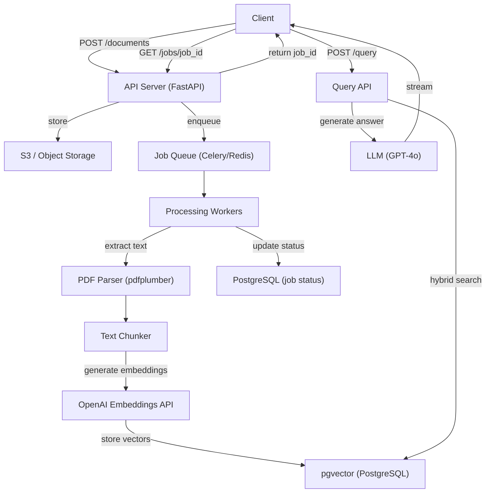

# 21. System Design Patterns

### Why This Section Matters

System design interviews test whether you can take an ambiguous problem ("design Twitter") and produce a coherent, scalable architecture with justified tradeoffs. At AI startups, the problems are more grounded: "design a RAG document pipeline," "design a real-time AI chat backend," "design a rate limiter."

The patterns in this section are the building blocks of every system design answer. Understanding them means you can compose reasonable architectures on a whiteboard rather than guessing.

**What interviewers actually probe:**
- How do you scale a read-heavy system?
- What's the difference between horizontal and vertical scaling?
- How does a CDN work and what are its limitations?
- How do you design a system that handles 100x traffic spikes?

---

## 21.1 Load Balancing and Horizontal Scaling

**Vertical scaling** — give one server more resources (more CPU, more RAM). Simple, no code changes. Limited: there's a maximum machine size, and a single point of failure.

**Horizontal scaling** — add more servers and distribute load. More complex, requires stateless servers, but no ceiling.

**Load balancer** — distributes requests across server instances. Strategies:

| Strategy | How it works | Best for |
|----------|-------------|---------|
| Round robin | Request 1 → server 1, request 2 → server 2, ... | Homogeneous requests |
| Least connections | Route to server with fewest active connections | Long-lived connections |
| IP hash | Hash client IP → always same server | Session affinity (sticky sessions) |
| Weighted | Route more traffic to powerful servers | Heterogeneous server capacity |

**Session affinity (sticky sessions):** If your application has server-side state (in-memory sessions), requests from the same user must go to the same server. Solution: use sticky sessions (IP hash or session cookie-based routing) OR move state to a shared store (Redis). The latter is better — sticky sessions create uneven load and break failover.

---

## 21.2 Caching Strategies at Scale

Caching reduces load on the database by serving repeated reads from fast in-memory storage. The patterns from §9 apply here at the system level.

**Cache topology:**

```
Client → CDN (edge cache)
       → Application server cache (in-process, e.g., Python dict)
       → Distributed cache (Redis cluster)
       → Database
```

Each layer has different characteristics:
- **CDN**: global, closest to user, seconds-to-minutes TTL, best for static assets and public API responses
- **In-process cache**: zero network overhead, not shared between instances, small and bounded
- **Redis**: shared across instances, millisecond latency, arbitrary data structures

**Cache invalidation at scale:**

```python
# Tag-based invalidation — invalidate all entries related to a user
async def update_user(user_id: str, data: UserUpdate):
    await db.update(User, user_id, data)

    # Invalidate all cached data tagged with this user
    keys = await redis.smembers(f"user_cache_keys:{user_id}")
    if keys:
        await redis.delete(*keys)
    await redis.delete(f"user_cache_keys:{user_id}")
```

---

## 21.3 Database Scaling Patterns

When a single PostgreSQL instance isn't enough:

**Read replicas:**
- Primary handles writes; replicas stream changes and handle reads
- Most apps are read-heavy — replicas can handle 80-90% of queries
- Replication lag: replicas are slightly behind — don't use replicas for reads that immediately follow a write

```python
# Route reads to replica, writes to primary
async def get_user(user_id: str):
    return await replica_db.get(User, user_id)

async def create_user(data: CreateUser):
    user = await primary_db.create(User(**data))
    # Don't immediately read from replica — it might not have this yet
    return user
```

**Sharding (partitioning by user):**
- Split data across multiple databases by a shard key (e.g., `user_id % N`)
- Queries that include the shard key are fast (go to one shard)
- Queries that cross shards are expensive (scatter-gather)
- PostgreSQL table partitioning (§5) is a single-node version of this

**CQRS (Command Query Responsibility Segregation):**
- Write model (commands) — normalized, transactional, optimized for writes
- Read model (queries) — denormalized, potentially in a different store, optimized for reads
- Events sync from write to read model asynchronously

---

## 21.4 CDN and Edge Caching

A CDN (Content Delivery Network) caches content at edge nodes geographically close to users. A user in Tokyo hitting your CDN gets the response from a Tokyo edge node, not your origin server in us-east-1.

```
User (Tokyo) → CDN edge (Tokyo) → [cache hit: return response]
                                → [cache miss: fetch from origin, cache, return]
               Origin server (us-east-1)
```

**What to cache at the CDN:**
- Static assets: JavaScript bundles, CSS, images (long TTL — cache-busted by filename hash)
- Public API responses: product catalog, public blog posts (short TTL — minutes)
- NOT: authenticated responses, user-specific data, real-time data

**Cache-Control at the CDN level:**

```
Cache-Control: public, max-age=31536000, immutable    ← static asset with content hash
Cache-Control: public, s-maxage=60, stale-while-revalidate=30  ← API response, 1min CDN cache
Cache-Control: private, no-cache                       ← user-specific — no CDN cache
```

`s-maxage` overrides `max-age` specifically for shared caches (CDN). `stale-while-revalidate` lets CDN serve slightly stale content while refreshing in the background — reduces latency spikes on TTL expiry.

---

## 21.5 Designing for Traffic Spikes

**The challenge:** A viral tweet sends 10x normal traffic in 30 seconds. Your normal capacity handles 1,000 req/s; the spike is 10,000 req/s.

**Strategies:**

**Auto-scaling:** Cloud providers (AWS, GCP) can launch new instances in 1-3 minutes on CPU/request spike. Not fast enough for 30-second spikes. Good for sustained load growth.

**Rate limiting:** Reject excess requests with 429 before they reach the database. Implemented at the API gateway or application level (§9 Redis rate limiting). Protects the system; trades off user experience.

**Queue-based load leveling:** Instead of processing requests immediately, enqueue them and process at a controlled rate. The queue absorbs spikes; workers process at steady state. Increases latency but prevents overload.

```
10,000 req/s → [Message Queue] → Worker pool (1,000/s steady state)
               Queue depth grows                 Level traffic
               Users wait longer, but no errors
```

**Idempotent async + polling:**
- Accept request immediately (enqueue + return job ID)
- Client polls for result
- Works when users can wait for the result (document processing, AI generation)

**Read path optimization for spikes (read storms):**
- Cache at multiple levels
- Serve slightly stale data (cache TTL) rather than hitting DB on every request
- Read replicas absorb spike reads

---

## 21.6 Sample Design: AI Document Processing Pipeline

A common system design question at AI startups: "Design a system where users upload PDFs, they're processed for RAG, and users can query them."



**Key design decisions to discuss:**
1. Why S3 before the queue? — decouple upload from processing, S3 is durable
2. Why a job queue? — PDF processing is slow (30s+), must not block the HTTP response
3. Why pgvector? — document data is relational (user_id, doc_id), co-located queries
4. Failure handling — worker crashes: `acks_late=True`, reprocessing is idempotent
5. Scaling — workers scale independently from the API (horizontal)

---

## 21.7 Interview Answer Scripts

**Q: "How would you scale a read-heavy API to handle 10x current traffic?"**

> "First, identify where the bottleneck is — which layer saturates first. Most read-heavy APIs bottleneck at the database, not the application tier. I'd start with read replicas: add one or more PostgreSQL replicas and route SELECT queries to them. Replicas typically handle the same load as the primary, so two replicas roughly triple read capacity. Second, add a caching layer for frequently repeated reads — Redis for API responses or computed results, CDN for public endpoints. Third, if the application tier is the bottleneck, horizontal scaling with a load balancer in front of stateless API servers. The key is starting with measurement, not assumption — adding a read replica first without confirming the DB is the bottleneck is premature."

**Q: "Walk me through designing a rate limiter."**

> "A rate limiter needs to work across multiple API server instances — so it needs a shared store, and Redis is the standard choice. For the algorithm, I'd use a sliding window with a Redis Sorted Set: on each request, add the current timestamp as a member, remove members older than the window, count remaining members, reject if over the limit. All three operations run in a Redis pipeline — one round trip. The key is scoped to the user or IP: `rate:{user_id}`. The TTL on the key prevents unbounded growth. For a more scalable version, I'd move rate limiting to an API gateway (NGINX, Kong, or a cloud load balancer), which applies it before requests reach application servers — protecting the entire stack."

**Q: "How would you design Nativ's backend to handle 100,000 daily active users?"**

> "Start from first principles — at 100,000 DAU, assuming each user makes 20 requests per day, that's roughly 2 million requests/day, or ~25 requests/second sustained. The current single-FastAPI + PostgreSQL architecture can likely handle this with tuning, but let me walk through each layer. Database: add one read replica for vocabulary queries (95% of requests are reads). PgBouncer for connection pooling — 100,000 users can't each maintain persistent connections. Add the HNSW index on pgvector with partitioning by user_id to keep per-user index size manageable. API tier: 2-3 stateless FastAPI instances behind a load balancer for horizontal scaling and redundancy. Caching: Redis for vocabulary query results (5-minute TTL), session tokens, and rate limiting state. LLM tier: this is the real scaling bottleneck — at 25 requests/second with LLM calls, you're hitting Anthropic API rate limits. Use a queue (Celery + Redis) to buffer LLM requests and process them within rate limits. The queue also enables async patterns — return immediately, notify via webhook when done."

**Q: "What is eventual consistency and when is it acceptable in a web API?"**

> "Eventual consistency means that after a write, reads from other nodes or replicas will eventually reflect that write — but there's a window where they might not. In a PostgreSQL setup with read replicas, writes go to the primary, and replicas lag by milliseconds to seconds depending on load. Reads from replicas are eventually consistent. This is acceptable when: the user doesn't need to immediately see their own write (analytics dashboards, leaderboards, feed counts), or when the data is read-mostly by many users who can tolerate slightly stale data (product catalog, public content). It's not acceptable when: a user updates their profile and immediately navigates to their profile page — they should see the new data. The pattern to handle this: read-your-own-writes consistency — for the current user's own data immediately after a write, read from the primary; all other reads can go to replicas."

---

## 21.8 Self-Tests

Try answering these before looking at the answers.

1. Your API response time is fine under normal load but degrades severely under spike traffic. Adding more API servers doesn't help. Where is the bottleneck likely to be, and what are two ways to address it?
2. You cache public product data with a 5-minute TTL in Redis. A marketing team updates a product's price. How do customers see the new price, and is there any way to make it faster?
3. You're using IP hash load balancing for sticky sessions. A user's IP changes mid-session (mobile network handoff). What happens and what's the fix?
4. Your system has a primary database and one read replica. You insert a new user, immediately redirect to a profile page, which reads from the replica. The profile page shows "user not found." Why and how do you fix it?
5. Describe the CAP theorem in one sentence and give a concrete example of a system choosing consistency over availability.

<details>
<summary>Answers</summary>

1. The bottleneck is likely the database — it's the one component that can't be horizontally scaled as easily as application servers. Two addresses: (a) **Read replicas**: add replicas and route reads to them. The primary only handles writes; replicas absorb read load. (b) **Caching**: identify the most frequently read, rarely changed data and cache it in Redis with a TTL. This removes DB load entirely for those reads. If the API servers are doing CPU-intensive work (complex computation, large JSON serialization), the bottleneck might be the app tier — profile first. Databases show as high connection counts, slow query logs, and high CPU/IO on the DB host.

2. With a 5-minute TTL, customers see the old price for up to 5 minutes after the update. To speed this up: use **event-driven invalidation** — when the product is updated, delete the cache key immediately. `redis.delete(f"product:{product_id}")`. The next request finds a cache miss, fetches from the database (with the new price), and repopulates the cache. This requires your product update code to also invalidate the cache. Alternatively, use **write-through caching** — update both the database and the cache in the same operation. The cache is always consistent with the DB.

3. The user is routed to a different server (because their IP changed), and that server has no session state for them — they're effectively logged out or lose their context. Fix: **don't rely on sticky sessions for state**. Move session state to a shared Redis store. Any server can look up the session by session ID (from a cookie), regardless of which server the request hits. This also improves fault tolerance — if a server dies, sessions aren't lost.

4. **Replication lag**. The replica receives changes from the primary asynchronously — there's a delay (typically milliseconds, but occasionally seconds under load). The INSERT committed on the primary but hasn't propagated to the replica yet when the profile page reads. Fix options: (a) **Read from primary for reads that immediately follow a write** — for the redirect after user creation, read the user from primary, not replica. (b) **Session-scoped read-your-own-writes**: after writing, read from primary for the current session (or for a short window), then fall back to replica. (c) Tolerate the lag — show a loading state or a "welcome, your profile is being set up" message for a few seconds.

5. CAP theorem: a distributed system can guarantee at most two of Consistency (every read sees the most recent write), Availability (every request gets a response), and Partition tolerance (the system works when network partitions occur) — since partition tolerance is non-optional in real networks, the real choice is between CP (consistency over availability) and AP (availability over consistency). Concrete example of choosing consistency over availability: **a bank account balance system**. Under a network partition, the system refuses reads rather than return a potentially stale balance. You get an error ("service unavailable") rather than a wrong number. PostgreSQL with synchronous replication is CP — a replica falling behind causes writes to block rather than diverge.

</details>

---

← Back to [20. Microservices vs Monolith](20-microservices.md) | Next → [22. LLM API Patterns](22-llm-api.md)
