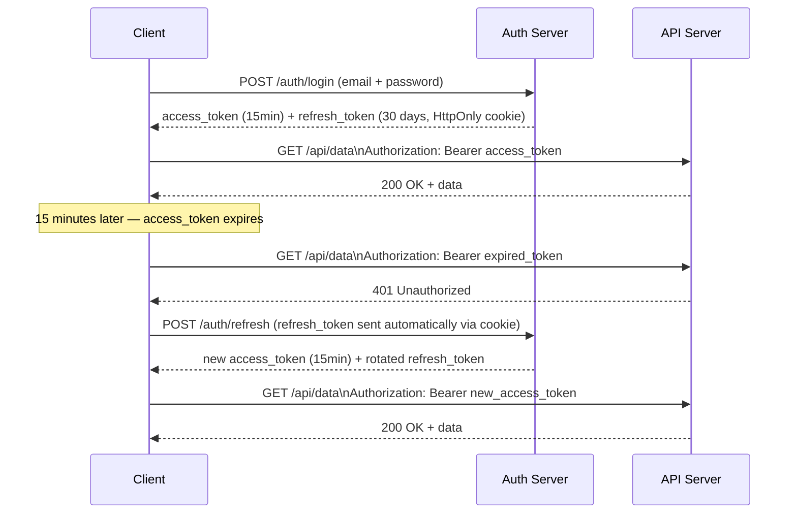
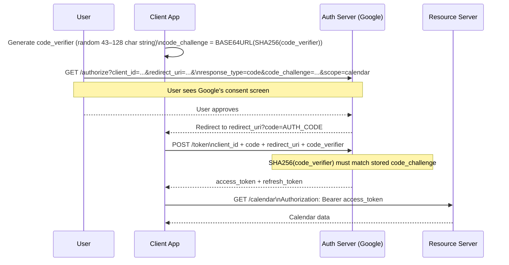

# 3. Authentication & Authorization

### Why This Section Matters

Auth bugs are uniquely dangerous — they don't crash your app, they silently let the wrong people in. A misconfigured JWT, a missing authorization check, or a refresh token stored in `localStorage` can compromise every user in your system.

Auth is also one of the most commonly misunderstood areas because the terminology is imprecise: "authentication" and "authorization" are used interchangeably in casual conversation, and "OAuth" is often confused with both.

**What interviewers actually probe:**
- Can you explain the difference between authentication and authorization with a real example?
- What are the attack vectors on JWTs, and how do you defend against each?
- Walk me through the OAuth Authorization Code + PKCE flow — what problem does PKCE solve?
- Where do you store tokens in a web app, and what are the tradeoffs?

---

## 3.1 Authentication vs Authorization

These are two distinct steps that always happen in the same order:

**Authentication** — "Who are you?" Verifying identity. The server checks a credential (password, token, certificate) and either accepts or rejects the claim.

**Authorization** — "What can you do?" Verifying permissions. Given a confirmed identity, the server checks whether that identity is allowed to perform the requested action.

```
Request: GET /admin/users
                 ↓
Authentication:  Is the token valid? Is it expired?     → 401 if not
                 ↓
Authorization:   Does this user have the "admin" role?  → 403 if not
                 ↓
Handler:         Return the user list                   → 200
```

**Common confusion:** HTTP's `401 Unauthorized` response is actually an authentication failure (misleading name). `403 Forbidden` is an authorization failure. The names are backwards from what you'd expect.

---

## 3.2 JWT — Structure, Signing, and Vulnerabilities

A JWT (JSON Web Token) is a self-contained credential: the server encodes claims into a signed token, and the client sends it back on every request. The server verifies the signature without a database lookup — stateless authentication.

**Structure:** Three base64url-encoded parts separated by dots.

```
eyJhbGciOiJIUzI1NiIsInR5cCI6IkpXVCJ9   ← Header  {"alg": "HS256", "typ": "JWT"}
.eyJ1c2VySWQiOiIxMjMiLCJleHAiOjE3MDAwMDB9  ← Payload {"userId": "123", "exp": 1700000}
.SflKxwRJSMeKKF2QT4fwpMeJf36POk6yJV_adQssw5c  ← Signature HMAC-SHA256(header.payload, secret)
```

The signature covers header + payload. Tamper with either, and signature verification fails.

**The five JWT attack vectors interviewers ask about:**

| Attack | How it works | Defense |
|--------|-------------|---------|
| `alg: none` | Attacker strips the signature and sets algorithm to "none" — server accepts any payload | Always validate `alg` explicitly; reject "none" |
| Algorithm confusion | Attacker changes RS256 (asymmetric) to HS256 (symmetric), signs with the public key | Pin the expected algorithm server-side; never infer from the token header |
| Token theft (XSS) | Token in `localStorage` is readable by JavaScript; XSS steals it | Store in `HttpOnly` cookie, or accept the XSS risk and mitigate with CSP |
| Replay attack | Valid token is captured and reused after the user logs out | Short expiry (`exp`) + token blacklist on logout (or rotate refresh tokens) |
| Weak secret | Short/guessable HMAC secret can be brute-forced offline | 256-bit random secret; or use RS256/ES256 (asymmetric — secret never leaves the server) |

**Token storage tradeoff:**

| Location | XSS risk | CSRF risk | Notes |
|----------|---------|----------|-------|
| `localStorage` | ❌ High — JS can read it | ✅ Safe — not sent automatically | Common in SPAs; risky if any XSS |
| `sessionStorage` | ❌ High | ✅ Safe | Cleared on tab close, otherwise same as localStorage |
| `HttpOnly` cookie | ✅ Safe — JS can't read it | ❌ Sent automatically on requests | Add `SameSite=Lax` to mitigate CSRF |
| Memory (JS variable) | ✅ Safe | ✅ Safe | Lost on page refresh; needs silent token refresh |

**Nativ's approach:** Access token in memory (React state), refresh token in `HttpOnly; Secure; SameSite=Lax` cookie. Memory-stored access tokens can't be stolen by XSS; the `HttpOnly` cookie is safe from XSS for refresh. `SameSite=Lax` mitigates CSRF.

---

## 3.3 Access Token + Refresh Token Pattern

Short-lived access tokens minimize damage from theft. But forcing re-login every 15 minutes is bad UX. The solution: pair a short-lived access token with a long-lived refresh token.



**Refresh token rotation:** Each use of the refresh token issues a new refresh token and invalidates the old one. If a stolen refresh token is used, the legitimate user's next refresh fails — both tokens are revoked and the user must re-login. This limits the damage window.

**Implementation — FastAPI:**

```python
from datetime import datetime, timedelta
from jose import jwt, JWTError
from fastapi import HTTPException, Cookie

SECRET = "use-a-256-bit-random-string"
ALGORITHM = "HS256"

def create_access_token(user_id: str) -> str:
    payload = {"sub": user_id, "exp": datetime.utcnow() + timedelta(minutes=15)}
    return jwt.encode(payload, SECRET, algorithm=ALGORITHM)

def create_refresh_token(user_id: str) -> str:
    payload = {"sub": user_id, "exp": datetime.utcnow() + timedelta(days=30), "type": "refresh"}
    return jwt.encode(payload, SECRET, algorithm=ALGORITHM)

@app.post("/auth/refresh")
async def refresh(refresh_token: str = Cookie(None)):
    if not refresh_token:
        raise HTTPException(401)
    try:
        payload = jwt.decode(refresh_token, SECRET, algorithms=[ALGORITHM])
        if payload.get("type") != "refresh":          # reject access tokens used as refresh
            raise HTTPException(401)
        user_id = payload["sub"]
    except JWTError:
        raise HTTPException(401)

    # invalidate old token, issue new pair
    new_access = create_access_token(user_id)
    new_refresh = create_refresh_token(user_id)
    # ... set new_refresh as HttpOnly cookie
    return {"access_token": new_access}
```

---

## 3.4 OAuth 2.0 — Authorization Code + PKCE

OAuth is often confused with authentication, but it's an *authorization* protocol — it lets a user grant a third-party app access to their resources without sharing their password.

**The core problem OAuth solves:** Alice uses "CoolApp" and wants it to read her Google Calendar. Without OAuth, she'd give CoolApp her Google password. With OAuth, Google issues a limited-scope access token to CoolApp — Alice never shares her password, and she can revoke the token anytime.

**Authorization Code flow (with PKCE for public clients):**



**What PKCE solves:** Without PKCE, if an attacker intercepts the `authorization_code` (possible on mobile via malicious apps registered to the same URI scheme), they can exchange it for tokens. PKCE requires the client to prove it was the one who started the flow: it creates a `code_verifier` at the start, sends a hash (`code_challenge`) to the auth server, then sends the original `code_verifier` at token exchange. An interceptor has the code but not the verifier — they can't complete the exchange.

**Scopes:** OAuth uses scopes to limit what the token can do. `scope=calendar.read` gives read-only calendar access. The user sees and approves the scope on the consent screen. This is the principle of least privilege applied to delegated access.

---

## 3.5 Password Hashing — argon2id

Passwords must never be stored in plain text or with reversible encryption. They must be hashed with a *slow* hash function designed to resist GPU-accelerated brute force.

**Why not SHA-256 or MD5?** They're designed to be fast. A modern GPU can compute billions of MD5 hashes per second — an entire password list from a breach can be cracked in hours.

**argon2id** is the current OWASP-recommended default:
- Memory-hard: requires large amounts of RAM, which limits parallelism on GPUs and ASICs
- Tunable: adjust time cost, memory cost, and parallelism to match hardware
- Winner of the Password Hashing Competition (2015)

```python
from argon2 import PasswordHasher

ph = PasswordHasher(
    time_cost=2,        # iterations
    memory_cost=65536,  # 64MB RAM required
    parallelism=2,
)

# Register
hashed = ph.hash("user_password")          # store this in DB

# Login
try:
    ph.verify(hashed, "user_password")      # raises if wrong
    if ph.check_needs_rehash(hashed):       # rehash if params changed
        hashed = ph.hash("user_password")
except Exception:
    raise HTTPException(401, "Invalid credentials")
```

**bcrypt is acceptable for existing systems** but has a 72-byte input limit — passwords longer than 72 bytes are silently truncated to 72 bytes. OWASP does not recommend pre-hashing (e.g. SHA-256 before bcrypt) because it can introduce null-byte injection issues. For new systems, use argon2id.

---

## 3.6 Role-Based Access Control (RBAC)

Authorization answers "what can you do?" RBAC is the most common model: users are assigned roles, roles have permissions.

```python
from enum import Enum
from fastapi import Depends, HTTPException

class Role(str, Enum):
    user = "user"
    admin = "admin"
    moderator = "moderator"

def require_role(*roles: Role):
    def dependency(current_user: User = Depends(get_current_user)):
        if current_user.role not in roles:
            raise HTTPException(403, "Insufficient permissions")
        return current_user
    return dependency

# Usage
@app.delete("/users/{user_id}")
async def delete_user(
    user_id: str,
    _: User = Depends(require_role(Role.admin)),   # only admins
):
    ...

@app.post("/posts/{post_id}/flag")
async def flag_post(
    post_id: str,
    _: User = Depends(require_role(Role.admin, Role.moderator)),  # either role
):
    ...
```

**RBAC vs ABAC (Attribute-Based Access Control):** RBAC assigns permissions to roles. ABAC adds conditions: "admin can delete users, but only in their own organization." ABAC is more flexible but harder to reason about. Most startup-scale products use RBAC with a few attribute checks added ad hoc.

---

## 3.7 Interview Answer Scripts

**Q: "What's the difference between authentication and authorization?"**

> "Authentication is identity verification — 'who are you?' The server checks your credential and either accepts or rejects your claim. Authorization is permission checking — 'what are you allowed to do?' Given a confirmed identity, the server checks whether that identity has rights to the requested resource or action. They always happen in that order: you can't check permissions for someone you don't know. In HTTP, 401 is an authentication failure — no valid identity established. 403 is an authorization failure — identity confirmed but permissions denied. The naming is unfortunately backwards from the semantics."

**Q: "What are the main JWT attack vectors and how do you defend against them?"**

> "Five main ones. First, the `alg: none` attack — an attacker strips the signature and sets the algorithm to 'none'; defend by always validating the algorithm explicitly and rejecting 'none'. Second, algorithm confusion — changing RS256 to HS256 and signing with the public key; defend by pinning the expected algorithm server-side, never trusting what's in the token header. Third, token theft via XSS — if the token is in localStorage, any injected script can read it; defend with HttpOnly cookies or strong CSP. Fourth, replay attacks after logout — defend with short expiry plus refresh token rotation, which invalidates old tokens. Fifth, weak secrets — short or guessable HMAC secrets can be brute-forced offline against a leaked token; use 256-bit random secrets or switch to RS256 so the signing key never leaves the server."

**Q: "What problem does PKCE solve in OAuth?"**

> "PKCE solves authorization code interception. In the standard Authorization Code flow, the auth server redirects to your app with an authorization code in the URL. On mobile, if two apps are registered to handle the same custom URI scheme, a malicious app can intercept that redirect and steal the code. Without PKCE, the attacker can exchange the code for tokens. PKCE adds a proof: your app generates a random `code_verifier` at the start of the flow, sends `SHA256(code_verifier)` as `code_challenge` to the auth server, then sends the original `code_verifier` at token exchange. The auth server checks that SHA256 of what you sent matches what was stored. An interceptor has the code but not the verifier — they can't complete the exchange."

**Q: "Where would you store JWT tokens in a web app and why?"**

> "It's a tradeoff between XSS and CSRF risk. localStorage is accessible to JavaScript — any XSS attack can steal the token. HttpOnly cookies can't be read by JavaScript, but they're sent automatically on every request, which is CSRF-friendly. My preferred pattern: store the access token in memory (React state) and the refresh token in an HttpOnly + Secure + SameSite=Lax cookie. Memory-stored access tokens can't be stolen by XSS. The HttpOnly refresh token is safe from XSS. SameSite=Lax blocks CSRF for the refresh endpoint because CSRF attacks are typically cross-site non-navigation requests. The cost: the access token is lost on page refresh, so you need a silent refresh call on app load using the cookie. In Nativ that's exactly what we do."

**Q: "Why is argon2id preferred over bcrypt for new systems?"**

> "Two reasons. bcrypt has a 72-byte input limit — passwords longer than 72 bytes are silently truncated. A user with a 100-character passphrase gets the same hash as someone using the first 72 characters, which is a security flaw and a usability surprise. Argon2id doesn't have this limit. More importantly, argon2id is memory-hard — it requires large amounts of RAM, which makes GPU and ASIC-based brute force attacks much less effective because you can't run millions of parallel instances without proportional RAM. Bcrypt is CPU-bound and cheaper to parallelize. For systems already using bcrypt, migration is fine — bcrypt is not broken, just sub-optimal. For new systems, argon2id is the OWASP recommendation."

---

## 3.8 Self-Tests

Try answering these before looking at the answers.

1. A user's JWT access token is valid but they were banned 2 minutes ago. The token expires in 13 minutes. How do you handle this without making every request hit the database?
2. Your colleague stores refresh tokens in a `users` table column. A user logs in from 3 devices. What's the problem and how would you fix the schema?
3. An OAuth `state` parameter is included in the authorization request. What attack does it prevent, and what should its value be?
4. You're building an API where users can share documents with specific other users. "Alice can read Bob's document, but Carol cannot." RBAC or ABAC? What does the schema look like?
5. A penetration tester reports that your `/api/users/{id}` endpoint returns 403 when they try to access another user's data, but leaks the user's email in the error message body. What's the fix and what principle does it violate?

<details>
<summary>Answers</summary>

1. This is the "token revocation" problem — the fundamental tension of stateless JWTs. Options, in order of complexity: (a) **Short expiry + blocking list**: keep a Redis set of banned/revoked token JTIs (`jti` claim). On every request, check Redis — O(1) lookup. Add the token's JTI when a user is banned. Purge expired entries. (b) **Very short access token (1–5 min)**: reduces the damage window to nearly nothing at the cost of more refresh calls. (c) **Opaque tokens**: abandon stateless JWTs; make every auth check hit a DB or cache. Restores full revocation control at the cost of a network hop per request. In Nativ, option (b) with 15-minute tokens is acceptable — a 15-minute window for a banned user is a reasonable tradeoff for simplicity.

2. Single-column refresh token means only one device can be logged in at a time — each new login overwrites the previous token. Fix: create a `refresh_tokens` table with `(id, user_id, token_hash, device_info, expires_at, created_at)`. Each login inserts a new row; each refresh rotates that specific row; logout deletes that row. This supports multiple simultaneous sessions with independent revocation. Never store the token itself — store a hash (SHA-256 is fine for refresh tokens since they're already random and long).

3. The `state` parameter prevents CSRF against the OAuth flow itself. Without it, an attacker can craft a malicious authorization URL and trick your browser into starting an OAuth flow that links the attacker's account to yours — login CSRF. `state` should be a random, unguessable value generated per-session (CSRF token for OAuth). The auth server echoes it back in the redirect; your app verifies it matches what was sent. If it doesn't match, the callback is rejected. It can also carry application state (e.g., the URL the user was trying to reach before login).

4. ABAC — the permission is on a specific (document, user) pair, not a role. Schema: a `document_permissions` table with `(document_id, user_id, permission)` — e.g., `(doc-123, alice-id, 'read')`. Authorization check: `SELECT 1 FROM document_permissions WHERE document_id = $1 AND user_id = $2 AND permission IN ('read', 'write')`. RBAC would require a role per-document per-user, which doesn't scale and conflates document access with system roles. The pattern is similar to Google Drive's sharing model.

5. The fix is to return a generic error message: `{"detail": "Not found"}` or `{"detail": "Access denied"}` — never include the target user's email, name, or any PII in an error response for a forbidden resource. The violated principle is **information disclosure** (OWASP A02/A03). The error message confirms to an attacker that (a) this user ID exists, and (b) this email address belongs to them. A 403 with no PII is correct; a 403 with the victim's email is a data breach. If the resource existence should be hidden, return 404 instead.

</details>

---

← Back to [2. REST API Design](2-rest-api-design.md) | Next → [4. SQL Fundamentals](4-sql-fundamentals.md)
